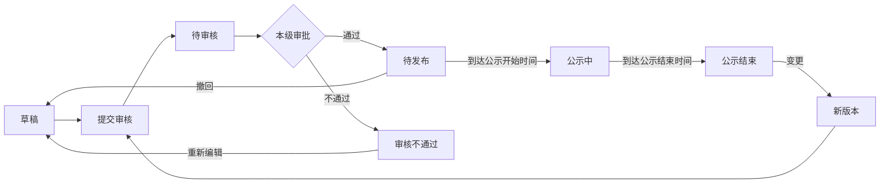

# 发布管理（事前公示）

> 关联文档：[项目执行总览](README.md)、[发布管理-邀请函](01_发布管理-邀请函.md)、[项目详情页](00_项目详情页.md)
>
> 适用范围：事前公示为**直接采购专属**发布环节，是直接采购执行流程的第一步，亦是**邀请函的强制前置**。

## 1. 业务流程

### 1.1 业务背景

事前公示仅适用于直接采购。直接采购面向单一指定供应商，属非公开、非竞争性采购，依法须进行事前公示接受监督。

| 采购方式 | 是否事前公示 | 供应商称呼 |
| ---- | ------ | ----- |
| 直接采购 | 是      | 供应商   |

> 立项环节「是否事前公示」字段仅直接采购显示，默认"是"，只读（详见[立项通用版 3.1.2](../项目立项功能设计_通用版.md)）。

---

## 2. 数据结构 + 状态值

### 2.1 数据结构

与邀请函一致，事前公示与标段为 **1:1** 关系：一条事前公示只关联当前标段，默认带入且不可取消。一个项目有多个标段时，各标段各自独立发布自己的事前公示。

```
事前公示主表（1条记录）
├── 标题区（公示名称 / 采购编号）
├── ① 项目信息（采购人 / 标段名称 / 拟采购项目范围内容 / 预算金额 / 直接采购依据 / 论证审查表附件）
├── ② 拟定供应商信息（供应商名称 / 供应商地址）
├── ③ 公示时间（公示开始时间 / 公示结束时间）
├── ④ 其他补充事宜（只读默认文本）
├── ⑤ 采购单位信息（采购人 / 地址 / 联系人 / 联系方式 / 邮箱）
└── ⑥ 附件（附件）

事前公示版本历史子表（每次变更一条记录）
└── 完整快照（主表全部内容）
```

> 异议子表本期不建。展示卡片「收到异议/异议答复」为派生展示字段（显数量），数据来自异议模块（项目详情页「查看异议」，详见[项目详情页 2.4](00_项目详情页.md)，功能后续补充）。异议模块未就绪前先显 0/—，待该模块上线后回补取数。

### 2.2 字段定义

> 事前公示对外发布到门户网站「其他公示」栏目（与招标公告同级），由系统自动处理，表单内不设发布媒体字段。

#### 标题区

| 字段       | 类型 | 必填 | 可编辑 | 说明                          |
| ---------- | ---- | ---- | ------ | ----------------------------- |
| 公示名称   | 文本 | ✅   | ✅      | 自动填充，默认「标段名称+事前公示」 |
| 采购编号   | 文本 | -    | ❌      | 标段/包编号带入，只读，暂定标段/包编号，不需填写 |

#### ① 项目信息

| 字段             | 类型   | 必填  | 可编辑 | 说明                                     |
| -------------- | ---- | --- | --- | -------------------------------------- |
| 采购人            | 文本   | -   | ❌   | 同采购单位信息.采购人，板块内只读展示                    |
| 标段名称           | 文本   | -   | ❌   | 标段带入，只读                                |
| 拟采购项目的范围/内容    | 文本域  | -   | ❌   | 标段「招标/采购范围」带入，只读                       |
| 拟采购项目的预算金额（万元） | 数字   | -   | ❌   | 标段概算价带入，只读                             |
| 采用直接采购采购方式的依据  | 文本域  | ✅   | ✅   | 手动填写，论证采用直接采购方式的理由                     |
| 直接采购方式论证审查表    | 文件上传 | ✅   | ✅   | 手动上传，支持多个 pdf/word；公示中官网可下载，公示结束隐藏下载按钮 |

#### ② 拟定供应商信息

| 字段       | 类型     | 必填 | 可编辑 | 说明                                                   |
| ---------- | -------- | ---- | ------ | ------------------------------------------------------ |
| 供应商名称 | 弹窗可选 | ✅   | ✅      | 默认带入立项邀请供应商，可改选；弹窗从供应商库选择，支持按名称/企业代码搜索 |
| 供应商地址 | 文本     | ✅   | ✅      | 选定供应商后带入，可编辑                               |

#### ③ 公示时间

| 字段         | 类型     | 必填 | 可编辑 | 说明                                                          |
| ------------ | -------- | ---- | ------ | ------------------------------------------------------------- |
| 公示开始时间 | 日期时间 | ✅   | ✅      | 自动计算，默认2天后0点，快捷选项：此刻/10分钟/20分钟/半小时    |
| 公示结束时间 | 日期时间 | ✅   | ✅      | 自动计算，= 公示开始时间 + 3天（自然日，强控），可改大不可改小 |

#### ④ 其他补充事宜

| 字段         | 类型   | 必填 | 可编辑 | 说明                                                          |
| ------------ | ------ | ---- | ------ | ------------------------------------------------------------- |
| 其他补充事宜 | 长文本 | -    | ❌      | 系统默认只读，"对公示内容有异议的，请于公示期内与联系人联系"   |

#### ⑤ 采购单位信息

| 字段     | 类型 | 必填 | 可编辑 | 说明                   |
| -------- | ---- | ---- | ------ | ---------------------- |
| 采购人   | 文本 | ✅   | ✅      | 自动带入单位名称信息   |
| 地址     | 文本 | ✅   | ✅      | 自动带入单位地址信息   |
| 联系人   | 文本 | ✅   | ✅      | 自动带入创建用户信息   |
| 联系方式 | 文本 | ✅   | ✅      | 自动带入创建用户信息   |
| 邮箱     | 文本 | 选填 | ✅      | 自动带入创建用户信息   |

#### ⑥ 附件

| 字段 | 类型     | 必填 | 可编辑 | 说明                                |
| ---- | -------- | ---- | ------ | ----------------------------------- |
| 附件 | 文件上传 | 选填 | ✅      | 手动上传，支持多个 pdf/word/图片    |

#### 系统字段

| 字段       | 类型 | 说明               |
| ---------- | ---- | ------------------ |
| 公示ID     | 主键 | 系统自动生成       |
| 当前版本号 | 数字 | 初始为1，每次变更+1 |
| 公示状态   | 文本 | 见 2.4 状态值      |
| 创建人/创建时间 | 系统 |                |
| 更新人/更新时间 | 系统 |                |

#### 派生展示字段（不入主表）

| 字段     | 说明                                                       |
| -------- | ---------------------------------------------------------- |
| 收到异议 | 公示期间收到的异议数量；异议模块未就绪前显 0/—             |
| 异议答复 | 已答复异议数量；异议模块未就绪前显 0/—                     |

### 2.3 版本历史子表

| 字段                           | 类型   | 必填 | 说明                                            |
| ------------------------------ | ------ | ---- | ----------------------------------------------- |
| 序号（version_history_id）     | 自增主键 | ✅  | 版本记录唯一标识                                |
| 公示ID（publicity_id）         | 外键   | ✅  | 关联事前公示主表                                |
| 版本号（version_number）       | 数字   | ✅  | 版本序号，初始为1，每次变更+1                    |
| 变更原因（change_reason）      | 长文本 | ❌  | 变更原因说明                                    |
| 公示主表快照（publicity_snapshot） | JSON | ✅ | 完整快照：标题区、项目信息、拟定供应商信息、公示时间、其他补充事宜、采购单位信息、附件 |
| 修改人（modified_by）          | 用户ID | ✅  | 发起变更的用户                                  |
| 修改时间（modified_at）        | 日期时间 | ✅ | 变更提交时间                                    |

### 2.4 状态值

| 状态    | 状态码                | 说明                | 允许操作           |
| ------- | --------------------- | ------------------- | ------------------ |
| 草稿    | `DRAFT`               | 编制中              | 编辑、提交审核、删除 |
| 待审核  | `PENDING_APPROVAL`    | 已提交，本级审批中  | 查看、撤回（审核组件留记录） |
| 审核不通过 | `APPROVAL_REJECTED` | 审批拒绝            | 编辑、提交审核、删除 |
| 待发布  | `APPROVED`            | 审批通过，未到公示开始时间 | 撤回、查看 |
| 公示中  | `PUBLICIZING`         | 到达公示开始时间，对外可见 | 查看 |
| 公示结束 | `PUBLICITY_ENDED`    | 公示期满3天，解锁邀请函发送 | 查看、变更（新版本重新送审） |

### 2.5 状态流转



**直接采购特殊前置（反向约束）**：
- 直接采购项目发送邀请函前，须先完成「事前公示」环节
- 新建邀请函时校验事前公示状态 = 公示结束，未完成则阻止新建并提示（详见[邀请函 1.1](01_发布管理-邀请函.md)）

**通用变更规则**：
- 变更审核通过后版本号+1并写入版本历史子表，新版本生效后替换原内容
- 变更审核期间，原公示继续对外展示
- 变更审核不通过时，版本号/变更次数不增加，不写入版本历史

---

## 3. 页面设计

### 3.1 事前公示信息展示区

**功能路径**：
- `采购系统 → 项目管理 → 我的项目 → 进入项目`
- `采购系统 → 项目管理 → 我的工作台 → 进入项目`

**页面结构**：

页面顶部为采购流程步骤页签（直接采购序列：事前公示 → 邀请函 → 采购文件 → 标前准备 → 开启 → 评审 → 成交 → 成交后），切换至"事前公示"页签后，下方展示事前公示信息卡片。

```
┌─ 项目详情页 ─────────────────────────────────────────────────────────────────┐
│  XX项目（标段A）                                                            │
│                                                                             │
│  [事前公示] [邀请函] [采购文件] [标前准备] [开启] [评审] [成交] [成交后]      │
│  ─────────────────────────────────────────────────────────────────────      │
│                                                                             │
│  ┌─────────────────────────────────────────────────────────────────────┐   │
│  │ 公示名称    │ XX标段A事前公示                                          │   │
│  │ 公示状态    │ 公示结束                                                │   │
│  │ 变更次数    │ 2次                                                     │   │
│  │ 公示开始时间 │ 2026-07-02 10:55                                       │   │
│  │ 公示结束时间 │ 2026-07-05 10:55                                       │   │
│  │ 收到异议    │ 0                                                       │   │
│  │ 异议答复    │ 0                                                       │   │
│  └─────────────────────────────────────────────────────────────────────┘   │
│                                                                             │
│  ┌─────────────────────────────────────────────────────────────────────┐   │
│  │                     [变更]  [查看]  [查看历史公示]                    │   │
│  └─────────────────────────────────────────────────────────────────────┘   │
│                                                                             │
└─────────────────────────────────────────────────────────────────────────────┘
```

**字段说明**：公示名称、公示状态、变更次数、公示开始时间、公示结束时间、收到异议（数量）、异议答复（数量）。

**操作按钮（与公示状态联动）**：

| 公示状态 | 操作按钮 |
|---------|---------|
| 草稿 | [编辑] [提交审核] [查看历史公示] |
| 待审核 | [撤回] [查看历史公示] |
| 审核不通过 | [编辑] [提交审核] [查看历史公示] |
| 待发布 | [撤回] [查看历史公示] |
| 公示中 | [查看] [查看历史公示] |
| 公示结束 | [变更] [查看] [查看历史公示] |

### 3.2 新建/编辑事前公示页

**触发方式**：项目详情页事前公示卡片点击 [新建] 或 [编辑]

**页面模块顺序**：标题区 → ① 项目信息 → ② 拟定供应商信息 → ③ 公示时间 → ④ 其他补充事宜 → ⑤ 采购单位信息 → ⑥ 附件

```
┌─ 新建事前公示（直接采购）──────────────────────────────────────────────────┐
│  [返回]                                                                   │
│                                                                            │
│  ▾ 标题区                                                                  │
│  ┌─────────────────────────────────────────────────────────────────────┐  │
│  │ * 公示名称  │ XX标段A事前公示                            （可编辑）   │  │
│  │   采购编号  │ PROJ-26-001A                              （只读）     │  │
│  └─────────────────────────────────────────────────────────────────────┘  │
│                                                                            │
│  ▾ ① 项目信息                                                             │
│  ┌─────────────────────────────────────────────────────────────────────┐  │
│  │ 采购人                   │ 国投泰康信托有限公司         （只读）     │  │
│  │ 标段名称                 │ XX标段A                      （只读）     │  │
│  │ * 拟采购项目的范围/内容  │ ┌───────────────────────────────┐（可编辑）│  │
│  │                          │                               │          │  │
│  │                          │ └───────────────────────────────┘          │  │
│  │   拟采购项目的预算金额    │ 117                           （只读）     │  │
│  │       （万元）           │                               万元        │  │
│  │ * 采用直接采购采购方式的  │ ┌───────────────────────────────┐（可编辑）│  │
│  │       依据               │                               │          │  │
│  │                          │ └───────────────────────────────┘          │  │
│  │ * 直接采购方式论证审查表  │ [ 上传文件 ]  支持多个 pdf/word            │  │
│  └─────────────────────────────────────────────────────────────────────┘  │
│                                                                            │
│  ▾ ② 拟定供应商信息                                                       │
│  ┌─────────────────────────────────────────────────────────────────────┐  │
│  │ [ 选择供应商 ]   默认带入立项邀请供应商，可改选                      │  │
│  │ * 供应商名称 │ XX公司                                  （弹窗可选）   │  │
│  │ * 供应商地址 │ XX市XX区XX路                            （带入可编辑）  │  │
│  └─────────────────────────────────────────────────────────────────────┘  │
│                                                                            │
│  ▾ ③ 公示时间                                                             │
│  ┌─────────────────────────────────────────────────────────────────────┐  │
│  │ * 公示开始时间 │ [ 2026-07-02 10:55 ]                              │  │
│  │                 │ 快捷：[此刻] [10分钟] [20分钟] [半小时]            │  │
│  │ * 公示结束时间 │ [ 2026-07-05 10:55 ]  （默认=开始时间+3天）         │  │
│  └─────────────────────────────────────────────────────────────────────┘  │
│                                                                            │
│  ▾ ④ 其他补充事宜                                                         │
│  ┌─────────────────────────────────────────────────────────────────────┐  │
│  │ 其他补充事宜 │ 对公示内容有异议的，请于公示期内与联系人联系（只读）  │  │
│  └─────────────────────────────────────────────────────────────────────┘  │
│                                                                            │
│  ▾ ⑤ 采购单位信息                                                         │
│  ┌─────────────────────────────────────────────────────────────────────┐  │
│  │ * 采购人   │ 国投泰康信托有限公司               （带入可编辑）      │  │
│  │ * 地址     │ 北京市西城区阜成门北大街...         （带入可编辑）      │  │
│  │ * 联系人   │ 刘欣莹                             （带入可编辑）        │  │
│  │ * 联系方式 │ 15383888290                        （带入可编辑）        │  │
│  │   邮箱     │                                    （带入可编辑）        │  │
│  └─────────────────────────────────────────────────────────────────────┘  │
│                                                                            │
│  ▾ ⑥ 附件                                                                 │
│  ┌─────────────────────────────────────────────────────────────────────┐  │
│  │ 附件 │ [ 上传文件 ]  支持多个 pdf/word/图片                         │  │
│  └─────────────────────────────────────────────────────────────────────┘  │
│                                                                            │
│  [ 保存草稿 ]  [ 提交审核 ]                                                │
│                                                                            │
└────────────────────────────────────────────────────────────────────────────┘
```

**交互逻辑**：

| 操作 | 行为 |
|------|------|
| 进入新建页 | 自动带出项目信息（采购人/标段名称/预算金额/拟采购范围）、采购单位信息；默认关联当前标段（只读不可取消）；公示名称默认填充「标段名称+事前公示」；采购编号带入标段/包编号；公示开始时间默认2天后0点；公示结束时间默认=开始时间+3天；拟定供应商默认带入立项邀请供应商；其他补充事宜默认只读文本；[新建]仅在该标段无事前公示时可用 |
| 修改公示开始时间 | 公示结束时间同步更新（= 开始时间 + 3天） |
| 修改采购单位信息.采购人 | 项目信息.采购人同步更新 |
| 选择供应商 | 弹窗从供应商库选择，支持按供应商名称/企业代码搜索；选定后带入供应商地址（可编辑）；默认带入的立项供应商可改选 |
| 点击保存草稿 | 校验公示名称、公示开始时间、论证审查表附件、已选供应商、拟采购范围、直接采购依据必填项，保存后状态为草稿 |
| 点击提交审核 | 校验全部必填项 + 公示期 ≥ 3天（结束时间 - 开始时间 ≥ 3 自然日），校验通过后进入待审核 |
| 校验失败 | 滚动定位到对应字段并提示错误 |

### 3.3 查看历史公示（弹窗）

**触发方式**：项目详情页事前公示卡片点击 [查看历史公示] 按钮

**弹窗内容**：

```
┌─ 历史事前公示 ───────────────────────────────────────────┐
│                                                       │
│  序号    公示名称              变更时间        操作     │
│ ───────────────────────────────────────────────────── │
│  1      XX标段A事前公示(v2)   2026-06-20     [查看]    │
│  2      XX标段A事前公示(v1)   2026-06-15     [查看]    │
│                                                       │
│                                              [关闭]    │
└───────────────────────────────────────────────────────┘
```

**字段说明**：

| 字段 | 说明 | 数据来源 |
|------|------|---------|
| 序号 | 版本历史记录序号 | 版本历史子表 version_history_id |
| 公示名称 | 该版本的公示名称（带版本号）| 版本历史子表 publicity_snapshot.公示名称 |
| 变更时间 | 变更创建时间 | 版本历史子表 modified_at |
| 操作 | [查看] 按钮 | 点击查看该版本快照详情 |

**快照详情弹窗**：
- 点击 [查看] 后打开新弹窗/抽屉，展示该版本的完整快照内容
- 展示字段与事前公示详情页一致（只读模式），包含标题区、项目信息、拟定供应商信息、公示时间、其他补充事宜、采购单位信息、附件
- 底部显示变更原因（如有）

### 3.4 变更操作

**触发方式**：项目详情页事前公示卡片（公示结束状态）点击 [变更]

**页面结构**：与新建/编辑事前公示页一致的标题区 + 6 个模块 + 变更内容，差异如下：

**模块差异**：
- 标题区：公示名称可编辑，采购编号只读
- ① **项目信息**：采购人/标段名称/预算金额 → 只读；拟采购范围/内容、直接采购依据、论证审查表附件可编辑（同新增）
- ② **拟定供应商信息**：可改选（同新增）
- ③ **公示时间**：公示开始时间、公示结束时间 → 只读
- ④ **其他补充事宜**：只读（同新增）
- ⑤ **采购单位信息**：可编辑（同新增）
- ⑥ **附件**：可增删（同新增）
- 末尾追加「变更内容」模块
- 按钮置于页面顶部

```
┌─ 变更事前公示 — XX标段A事前公示（第2次变更）
│  [取消变更]  [保存]  [提交审核]                                    ──── 顶部按钮
│
│  ▾ 标题区
│  ┌─────────────────────────────────────────────────────────────────┐
│  │ * 公示名称  │ XX标段A事前公示                      （可编辑）    │
│  │   采购编号  │ PROJ-26-001A                         （只读）      │
│  └─────────────────────────────────────────────────────────────────┘
│  ▾ ① 项目信息
│  ┌─────────────────────────────────────────────────────────────────┐
│  │ 采购人                   │ 国投泰康信托有限公司      （只读）     │
│  │ 标段名称                 │ XX标段A                   （只读）     │
│  │ * 拟采购项目的范围/内容  │ ┌─────────────────────┐  （可编辑）    │
│  │                          │                       │               │
│  │                          │ └─────────────────────┘               │
│  │   拟采购项目的预算金额    │ 117                     （只读）      │
│  │       （万元）           │                        万元           │
│  │ * 采用直接采购采购方式的  │ ┌─────────────────────┐  （可编辑）    │
│  │       依据               │                       │               │
│  │                          │ └─────────────────────┘               │
│  │ * 直接采购方式论证审查表  │ [ 上传文件 ]  支持多个 pdf/word       │
│  └─────────────────────────────────────────────────────────────────┘
│  ▾ ② 拟定供应商信息（可改选，同新增）
│  ▾ ③ 公示时间
│  ┌─────────────────────────────────────────────────────────────────┐
│  │   公示开始时间 │ 2026-07-02 10:55          （只读）             │
│  │   公示结束时间 │ 2026-07-05 10:55          （只读）             │
│  └─────────────────────────────────────────────────────────────────┘
│  ▾ ④ 其他补充事宜（只读，同新增）
│  ▾ ⑤ 采购单位信息（可编辑，同新增）
│  ▾ ⑥ 附件（可增删，同新增）
│  ▾ 变更内容
│  ┌─────────────────────────────────────────────────────────────────┐
│  │ XX标段A事前公示（第2次变更）                                     │
│  │ ────────────────────────────────────────────────                │
│  │ 拟定供应商                                                        │
│  │  原供应商：YY公司                                                  │
│  │  变更为：ZZ公司  （红色）                                           │
│  │                                                                  │
│  │ 采用直接采购采购方式的依据                                        │
│  │  原内容：需向原供应商采购，否则将影响施工或者功能配套要求          │
│  │  变更为：需向原供应商采购，且无替代供应商  （红色）                 │
│  │                                                                  │
│  │ 直接采购方式论证审查表                                            │
│  │  新增：论证审查表_v2.pdf                                          │
│  │  移除：论证审查表_v1.pdf                                          │
│  │                                                                  │
│  │ 附件                                                              │
│  │  新增：补充说明.pdf                                               │
│  │                                                                  │
│  │ （变更内容实时更新，追踪拟采购范围/依据/论证审查表附件/拟定供应商/采购单位信息/附件变更）│
│  └─────────────────────────────────────────────────────────────────┘
│                                                                         │
└─────────────────────────────────────────────────────────────────────────┘
```

**变更内容模块规则**：

| 规则 | 说明 |
|------|------|
| 标题 | 公示名称（第x次变更），x=当前版本号-1 |
| 数据来源 | 页面打开时前端缓存当前版本快照数据，后续实时对比差异 |
| 追踪范围 | 拟采购项目范围/内容、采用直接采购采购方式的依据、直接采购方式论证审查表附件、拟定供应商改选、采购单位信息、附件变更 |
| 显示格式 | 文本字段：`字段：XXX` <br> `原内容：XXX` <br> `变更为：XXX（红色显示）`；供应商改选：`原供应商：XXX` <br> `变更为：XXX（红色显示）`；附件变更：`新增：XXX` / `移除：XXX` |
| 触发时机 | 用户编辑对应字段时实时更新，未修改不显示 |
| 无变更时 | 提示"暂无变更信息" |

**交互逻辑**：

| 操作 | 行为 |
|------|------|
| 进入页面 | 自动带出当前事前公示内容；前端缓存当前版本快照 |
| 修改可编辑字段 | 实时对比快照，更新变更内容模块 |
| 改选拟定供应商 | 实时对比快照，更新变更内容模块 |
| 增删论证审查表附件/附件 | 实时对比快照，更新变更内容模块 |
| 修改采购单位信息 | 实时对比快照，更新变更内容模块 |
| 点击取消变更 | 不提示，直接返回项目详情页，不保存 |
| 点击保存 | 保存当前编辑内容，不提交审核，变更内容模块保持 |
| 点击提交审核 | 校验后提交审核，进入待审核 |

---

## 4. 审批流程

| 业务 | 审批路径 | 说明 |
|------|---------|------|
| 事前公示发布 | 仅本级审批 | 全部审核节点通过后进入待发布状态 |
| 事前公示变更 | 同事前公示发布 | 变更后的新版本需重新走完整审批流程 |

**审批说明**：
- 事前公示仅走本级审批，**无委托人确认环节**（区别于公告/邀请函）
- 待审核状态可撤回，审核组件留下撤回记录，状态变为草稿
- 公示开始时间必须晚于当前时间（提交审核时校验）。若审核期间公示开始时间已过（早于当前时间），审批通过后变更为草稿状态

---

## 5. 待确认问题

| #   | 问题                                                                | 状态  |
| --- | ----------------------------------------------------------------- | --- |
| 1   | 立项拟定供应商变更时如何同步到已建事前公示？事前公示默认带入立项供应商且可改选，是否需要立项变更后同步刷新逻辑？         | 待确认 |
| 2   | 邀请函已发送后，是否还允许变更事前公示？若允许，对已发送邀请函的影响如何处理？                          | 待确认 |
| 3   | 变更校验时点参照：公告/邀请函以截标/开标时间为界，事前公示无截标时间，拟以邀请函发送时间为界（变更须在邀请函发送前完成），是否合理？ | 待确认 |
| 4   | 变更时公示开始时间是否绝对只读（不允许延期公示），还是允许修改公示开始时间重走审批？当前设计为只读，仅允许变更其他内容。      | 待确认 |
| 5   | 「收到异议/异议答复」取数依赖异议模块（项目详情页「查看异议」，功能后续补充），本期先显 0/—，待异议模块上线后回补取数与展示。  | 待确认 |
| 6   | 直接采购方式论证审查表的内容要求/格式是否有标准规范？由采购方自行准备还是有统一模板？                       | 待确认 |
