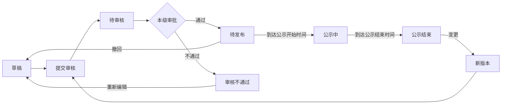

# 发布管理（事前公示）

> 关联文档：[项目执行总览](README.md)、[发布管理-邀请函](01_发布管理-邀请函.md)、[项目详情页](00_项目详情页.md)
>
> 适用范围：事前公示为**直接采购专属**发布环节，是直接采购执行流程的第一步，亦是**邀请函的强制前置**。

## 1. 业务流程

### 1.1 事前公示发布与变更流程



**直接采购特殊前置（反向约束）**：
- 直接采购项目发送邀请函前，须先完成「事前公示」环节
- 新建邀请函时校验事前公示状态 = 公示结束，未完成则阻止新建并提示（详见[邀请函 1.1](01_发布管理-邀请函.md)）

**通用变更规则**：
- 已发布（公示结束）状态变更时保留原版本快照到版本历史子表
- 主表更新为最新版本内容，版本号自增
- 变更审核期间，原公示继续对外展示；新版本审核通过并生效后替换原内容

---

## 2. 数据结构 + 状态值

### 2.1 事前公示适用采购方式

事前公示仅适用于直接采购。直接采购面向单一指定供应商，属非公开、非竞争性采购，依法须进行事前公示接受监督。

| 采购方式 | 是否事前公示 | 供应商称呼 |
| ---- | ---- | ----- |
| 直接采购 | 是 | 供应商 |

> 立项环节「是否事前公示」字段仅直接采购显示，默认"是"，只读（详见[立项通用版 3.1.2](../项目立项功能设计_通用版.md)）。

### 2.2 事前公示数据结构

与邀请函一致，事前公示与标段为 **1:1** 关系：一条事前公示只关联当前标段，默认带入且不可取消。一个项目有多个标段时，各标段各自独立发布自己的事前公示。

```
事前公示主表（1条记录）
├── 关联项目（只读带入）
├── 直接采购方式论证审查表（附件上传，必填，提供模板下载）   ← 并入项目信息模块
├── 公示信息（名称/公示开始时间/公示结束时间/附件）
├── 关联标段（当前标段，只读，1:1 不可取消）
├── 拟定供应商（默认带入立项供应商，可改选）
├── 采购单位信息（只读带入）
└── 其他相关说明（非招标类系统模板）

事前公示版本历史子表（每次变更一条记录）
└── 完整快照（主表全部内容）
```

> 异议子表本期不建。展示卡片「收到异议/异议答复」为派生展示字段（显数量），数据来自异议模块（项目详情页「查看异议」，详见[项目详情页 2.4](00_项目详情页.md)，功能后续补充）。异议模块未就绪前先显 0/—，待该模块上线后回补取数。

### 2.3 字段定义

#### 事前公示主表字段

**关联项目 + 直接采购方式论证审查表**（并入「项目信息」模块，自动带入只读为主）：

| 字段        | 类型   | 必填  | 来源     | 可编辑 | 说明                          |
| --------- | ------ | ---- | -------- | --- | --------------------------- |
| 项目名称      | 文本    | -    | 自动带入项目 | ❌   |                             |
| 项目编号      | 文本    | -    | 自动带入项目 | ❌   |                             |
| 项目类型      | 文本    | -    | 自动带入项目 | ❌   | 工程/物资/服务                    |
| 采购方式      | 文本    | -    | 自动带入项目 | ❌   | 直接采购                        |
| 行业分类      | 文本    | -    | 自动带入项目 | ❌   | 本项目行业分类                     |
| 组织形式      | 文本    | -    | 自动带入项目 | ❌   | 委托采购/自行采购                   |
| 项目概况      | 文本域  | ❌   | 自动带入项目 | ✅   | 可编辑                         |
| 其他        | 文本域  | ❌   | 自动带入项目 | ✅   | 可编辑                         |
| 论证审查表附件  | 文件上传 | ✅   | 手动上传    | ✅   | 直接采购方式论证审查表，支持多个 pdf/word；旁置「下载论证审查表模板」按钮 |

**公示信息**：

| 字段     | 类型    | 必填  | 来源   | 可编辑 | 说明                                                              |
| ------ | ------- | ---- | ------ | --- | --------------------------------------------------------------- |
| 公示名称   | 文本     | ✅   | 自动填充 | ✅   | 默认「标段名称+事前公示」                                                  |
| 公示开始时间 | 日期时间  | ✅   | 自动计算 | ✅   | 默认2天后0点，快捷选项：此刻/10分钟/20分钟/半小时                                  |
| 公示结束时间 | 日期时间  | ✅   | 自动计算 | ✅   | = 公示开始时间 + 3天（自然日，强控）；公示期 ≥ 3天，可改大不可改小                         |
| 公示附件   | 文件上传  | ❌   | 手动上传 | ✅   | 除论证审查表外的其他公示附件，支持多个 pdf/word/图片                                |

> 公示发布媒体不在表单中展示与选择。事前公示对外发布到门户网站「非招标采购公告」栏目由系统自动处理。

**关联标段**：

| 字段   | 类型       | 必填  | 可编辑 | 说明                       |
| ---- | ---------- | ---- | --- | ------------------------ |
| 关联标段 | 标段（只读） | ✅   | ❌   | 默认当前标段，1:1 不可取消，一标段一事前公示 |

**拟定供应商**：

| 字段     | 类型       | 必填  | 来源                 | 可编辑 | 说明                              |
| ------ | ---------- | ---- | ------------------ | --- | ------------------------------- |
| 供应商名称  | 弹窗可选     | ✅   | 默认带入立项邀请供应商 | ✅   | 弹窗从供应商库选择，支持按供应商名称/企业代码搜索；可改选 |
| 供应商地址  | 文本       | ✅   | 选定供应商后带入      | ✅   |                                 |

**采购单位信息**（只读带入）：

| 字段     | 类型 | 必填 | 可编辑 | 说明   |
| -------- | ---- | ---- | ------ | ----- |
| 采购单位名称 | 文本 | -    | ❌     | 自动带入 |
| 采购单位地址 | 文本 | -    | ❌     | 自动带入 |
| 联系人     | 文本 | -    | ❌     | 自动带入 |
| 联系电话     | 文本 | -    | ❌     | 自动带入 |

**其他相关说明**：

| 字段     | 类型  | 必填  | 可编辑 | 说明                |
| ------ | --- | --- | --- | ----------------- |
| 发布媒介说明 | 长文本 | ❌   | ✅   | 系统模板，文本因采购方式而异       |
| 注册说明   | 长文本 | ❌   | ✅   | 系统模板，文本因采购方式而异       |
| 平台使用费  | 长文本 | ❌   | ✅   | 系统模板，直接采购适用         |
| 文件下载   | 长文本 | ❌   | ✅   | 系统模板，文本因采购方式而异       |
| CA办理   | 长文本 | ❌   | ✅   | 系统模板，非招标可不办理        |
| 帮助信息   | 长文本 | ❌   | ✅   | 系统模板，各采购方式一致         |
| 其他信息   | 长文本 | ❌   | ✅   | 系统模板，非招标不含异议条款      |

**默认填充内容**：

> 以下为系统模板默认填充的长文本内容，均为选填、可编辑。其中 `{当前租户的采购官网}`、`{当前租户的采购官网地址}` 为运行时替换变量。

**非招标类（直接采购）**：

- **发布媒介说明**：本次事前公示同时在 `{当前租户的采购官网}`（`{当前租户的采购官网地址}`）上发布，对于因其他网站转载并发布的非完整版或修改版公示，而导致损失的情形，采购人及采购代理机构不予承担责任。
- **注册说明**：供应商登录电子采购平台门户网站，点击右上角【用户注册】注册用户账号，填写企业基本信息提交审核，审核情况将在24小时内（不含法定节假日）进行反馈。基本信息审核通过的供应商，方可参与项目，请合理安排注册时间。
- **平台使用费**：供应商若中标，须在取得成交通知书前缴纳平台使用费（收费标准及方式详见门户网站－通知公告或帮助中心－常见问题）。
- **文件下载**：供应商登录电子采购平台门户网站，点击右上角【用户登录】-【供应商系统】，在【公告信息-采购公告】或【我的邀请】中选择项目，点击【进入项目】进入工作台，在【采购文件】环节，点击【下载采购文件】自行下载采购文件电子版，采购方不再提供纸质采购文件。
- **CA办理**：目前非招标项目可不办理ＣＡ。
- **帮助信息**：如需帮助请登录电子采购平台网站首页【帮助中心】-【操作指南】。
- **其他信息**：本次采购活动所有信息发布和联络以注册及参与项目时填写的信息为准，供应商应对填写的所有信息的真实性和准确性负责，并自行承担信息有误导致的一切后果。

**系统字段**：

| 字段       | 类型  | 说明               |
| -------- | --- | ---------------- |
| 公示ID     | 主键  | 系统自动生成           |
| 当前版本号    | 数字  | 版本记录，初始为1，每次变更+1 |
| 公示状态     | 文本  | 见下方状态字典          |
| 创建人/创建时间 | 系统  |                  |
| 更新人/更新时间 | 系统  |                  |

#### 派生展示字段（不入主表）

| 字段 | 来源 | 说明 |
| --- | --- | --- |
| 收到异议 | 异议模块（待设计） | 公示期间收到的异议数量；异议模块未就绪前显 0/— |
| 异议答复 | 异议模块（待设计） | 已答复异议数量；异议模块未就绪前显 0/— |

### 2.4 事前公示版本历史子表

| 字段                            | 类型   | 必填  | 说明                                                 |
| ----------------------------- | ---- | --- | -------------------------------------------------- |
| 序号（version_history_id）        | 自增主键 | ✅   | 版本记录唯一标识                                           |
| 公示ID（publicity_id）            | 外键   | ✅   | 关联事前公示主表                                           |
| 版本号（version_number）           | 数字   | ✅   | 版本序号，初始为1，每次变更+1                                   |
| 变更原因（change_reason）          | 长文本  | ❌   | 变更原因说明                                             |
| 公示主表快照（publicity_snapshot）   | JSON | ✅   | 完整快照：项目信息、论证审查表附件、公示信息、拟定供应商、采购单位信息、其他相关说明          |
| 修改人（modified_by）              | 用户ID | ✅   | 发起变更的用户                                            |
| 修改时间（modified_at）             | 日期时间 | ✅   | 变更提交时间                                             |

### 2.5 状态字典

**事前公示主表状态**：

| 状态    | 状态码                 | 说明                | 允许操作           |
| ----- | ------------------- | ----------------- | -------------- |
| 草稿    | `DRAFT`             | 编制中               | 编辑、提交审核、删除     |
| 待审核   | `PENDING_APPROVAL`  | 已提交，本级审批中         | 查看、撤回（审核组件留记录） |
| 审核不通过 | `APPROVAL_REJECTED` | 审批拒绝              | 编辑、提交审核、删除     |
| 待发布   | `APPROVED`          | 审批通过，未到公示开始时间     | 撤回、查看          |
| 公示中   | `PUBLICIZING`       | 到达公示开始时间，对外可见     | 查看             |
| 公示结束  | `PUBLICITY_ENDED`   | 公示期满3天，解锁邀请函发送    | 查看、变更（新版本重新送审） |

> 公示结束后方可发送邀请函；邀请函新建时校验事前公示状态 = 公示结束。

---

## 3. 页面设计

### 3.1 事前公示信息展示区

**功能路径**：
- `采购系统 → 项目管理 → 我的项目 → 进入项目`
- `采购系统 → 项目管理 → 我的工作台 → 进入项目`

**页面结构**：

页面顶部为采购流程步骤页签（直接采购序列：事前公示 → 邀请函 → 采购文件 → 标前准备 → 开启 → 评审 → 成交 → 成交后），切换至"事前公示"页签后，下方展示事前公示信息卡片。

```
┌─ 项目详情页 ─────────────────────────────────────────────────────────────────┐
│  XX项目（标段A）                                                            │
│                                                                             │
│  [事前公示] [邀请函] [采购文件] [标前准备] [开启] [评审] [成交] [成交后]      │
│  ─────────────────────────────────────────────────────────────────────      │
│                                                                             │
│  ┌─────────────────────────────────────────────────────────────────────┐   │
│  │ 公示名称    │ XX标段A事前公示                                          │   │
│  │ 公示状态    │ 公示结束                                                │   │
│  │ 组织形式    │ 自行采购                                                │   │
│  │ 采购方式    │ 直接采购                                                │   │
│  │ 变更次数    │ 2次                                                     │   │
│  │ 公示开始时间 │ 2026-06-15 00:00                                       │   │
│  │ 公示结束时间 │ 2026-06-18 00:00                                       │   │
│  │ 收到异议    │ 0                                                       │   │
│  │ 异议答复    │ 0                                                       │   │
│  └─────────────────────────────────────────────────────────────────────┘   │
│                                                                             │
│  ┌─────────────────────────────────────────────────────────────────────┐   │
│  │                     [变更]  [查看]  [查看历史公示]                    │   │
│  └─────────────────────────────────────────────────────────────────────┘   │
│                                                                             │
└─────────────────────────────────────────────────────────────────────────────┘
```

**字段说明**：公示名称、公示状态、组织形式、采购方式、变更次数、公示开始时间、公示结束时间、收到异议（数量）、异议答复（数量）。

**操作按钮（与公示状态联动）**：

| 公示状态 | 操作按钮 |
|---------|---------|
| 草稿 | [编辑] [提交审核] [查看历史公示] |
| 待审核 | [撤回] [查看历史公示] |
| 审核不通过 | [编辑] [提交审核] [查看历史公示] |
| 待发布 | [撤回] [查看历史公示] |
| 公示中 | [查看] [查看历史公示] |
| 公示结束 | [变更] [查看] [查看历史公示] |

### 3.2 新建/编辑事前公示页

**触发方式**：项目详情页事前公示卡片点击 [新建] 或 [编辑]

**页面模块顺序**：项目信息（含论证审查表） → 公示信息 → 标段/包信息 → 拟定供应商 → 采购单位信息 → 其他相关说明

```
┌─ 新建事前公示（直接采购）──────────────────────────────────────────────────┐
│  [返回]                                                                   │
│                                                                            │
│  ▾ ① 项目信息（含直接采购方式论证审查表）                                    │
│  ┌─────────────────────────────────────────────────────────────────────┐  │
│  │ 项目名称    │ XX项目                                    （只读）       │  │
│  │ 项目编号    │ XXXX                                      （只读）       │  │
│  │ 项目类型    │ 工程                                      （只读）       │  │
│  │ 采购方式    │ 直接采购                                    （只读）       │  │
│  │ 行业分类    │ 工业                                      （只读）       │  │
│  │ 组织形式    │ 自行采购                                    （只读）       │  │
│  │ 项目概况    │ ┌───────────────────────────────────────────┐（可编辑）   │  │
│  │             │                                           │          │  │
│  │             │ └───────────────────────────────────────────┘          │  │
│  │ 其他        │ ┌───────────────────────────────────────────┐（可编辑）   │  │
│  │             │                                           │          │  │
│  │             │ └───────────────────────────────────────────┘          │  │
│  │             │                                                          │  │
│  │ 直接采购方式论证审查表                                                │  │
│  │ * 论证审查表附件 │ [ 上传文件 ]  [ 下载论证审查表模板 ]              │  │
│  │                 │ 支持多个 pdf/word                                    │  │
│  └─────────────────────────────────────────────────────────────────────┘  │
│                                                                            │
│  ▾ ② 公示信息                                                              │
│  ┌─────────────────────────────────────────────────────────────────────┐  │
│  │ * 公示名称      │ XX标段A事前公示                                   │  │
│  │ * 公示开始时间  │ [ 2026-06-17 00:00 ]                            │  │
│  │                 │ 快捷：[此刻] [10分钟] [20分钟] [半小时]            │  │
│  │ * 公示结束时间  │ [ 2026-06-20 00:00 ]  （默认=开始时间+3天）       │  │
│  │   公示附件      │ [ 上传文件 ]  支持pdf/word/图片                    │  │
│  └─────────────────────────────────────────────────────────────────────┘  │
│                                                                            │
│  ▾ ③ 标段/包信息                                                          │
│  ┌─ 关联标段：标段A（只读，默认当前标段，1:1 不可取消）────────────────────┐  │
│  └─────────────────────────────────────────────────────────────────────┘  │
│                                                                            │
│  ▾ ④ 拟定供应商                                                            │
│  ┌─────────────────────────────────────────────────────────────────────┐  │
│  │ [ 选择供应商 ]   默认带入立项邀请供应商，可改选                      │  │
│  │ * 供应商名称 │ XX公司                                  （弹窗可选）   │  │
│  │ * 供应商地址 │ XX市XX区XX路                            （带入可编辑）  │  │
│  └─────────────────────────────────────────────────────────────────────┘  │
│                                                                            │
│  ▾ ⑤ 采购单位信息                                                          │
│  ┌─────────────────────────────────────────────────────────────────────┐  │
│  │ 采购单位名称 │ XXX公司                                    （只读）       │  │
│  │ 采购单位地址 │ XXX市XXX区XXX路                          （只读）       │  │
│  │ 联系人       │ 李四                                      （只读）       │  │
│  │ 联系电话     │ 138XXXXXXXX                              （只读）       │  │
│  └─────────────────────────────────────────────────────────────────────┘  │
│                                                                            │
│  ▾ ⑥ 其他相关说明                                                          │
│  ┌─────────────────────────────────────────────────────────────────────┐  │
│  │ 发布媒介说明  │ ┌───────────────────────────────────────────┐          │  │
│  │               │                                            │          │  │
│  │               │ └───────────────────────────────────────────┘          │  │
│  │ 注册说明      │ ┌───────────────────────────────────────────┐          │  │
│  │               │                                            │          │  │
│  │               │ └───────────────────────────────────────────┘          │  │
│  │ 平台使用费    │ ┌───────────────────────────────────────────┐          │  │
│  │               │                                            │          │  │
│  │               │ └───────────────────────────────────────────┘          │  │
│  │ 文件下载      │ ┌───────────────────────────────────────────┐          │  │
│  │               │                                            │          │  │
│  │               │ └───────────────────────────────────────────┘          │  │
│  │ CA办理        │ ┌───────────────────────────────────────────┐          │  │
│  │               │                                            │          │  │
│  │               │ └───────────────────────────────────────────┘          │  │
│  │ 帮助信息      │ ┌───────────────────────────────────────────┐          │  │
│  │               │                                            │          │  │
│  │               │ └───────────────────────────────────────────┘          │  │
│  │ 其他信息      │ ┌───────────────────────────────────────────┐          │  │
│  │               │                                            │          │  │
│  │               │ └───────────────────────────────────────────┘          │  │
│  └─────────────────────────────────────────────────────────────────────┘  │
│                                                                            │
│  [ 保存草稿 ]  [ 提交审核 ]                                                │
│                                                                            │
└────────────────────────────────────────────────────────────────────────────┘
```

**交互逻辑**：

| 操作         | 行为                                                                                        |
| ---------- | ----------------------------------------------------------------------------------------- |
| 进入新建页      | 自动带出项目信息/采购单位信息；默认关联当前标段（只读不可取消）；公示名称默认填充「标段名称+事前公示」；公示开始时间默认2天后0点；公示结束时间默认=开始时间+3天；拟定供应商默认带入立项邀请供应商；模板文本按非招标类填充；论证审查表区提供「下载论证审查表模板」按钮；[新建]仅在该标段无事前公示时可用 |
| 修改公示开始时间   | 公示结束时间同步更新（= 开始时间 + 3天）                                                                    |
| 选择供应商      | 弹窗从供应商库选择，支持按供应商名称/企业代码搜索；选定后带入供应商地址（可编辑）；默认带入的立项供应商可改选                                  |
| 下载论证审查表模板  | 下载标准 Word 模板供线下填写后上传                                                                       |
| 点击保存草稿     | 校验公示名称、公示开始时间、论证审查表附件、已选供应商必填项，保存后状态为草稿                                                    |
| 点击提交审核     | 校验全部必填项 + 公示期 ≥ 3天（结束时间 - 开始时间 ≥ 3 自然日），校验通过后进入待审核                                        |
| 校验失败       | 滚动定位到对应字段并提示错误                                                                             |

### 3.3 查看历史公示（弹窗）

**触发方式**：项目详情页事前公示卡片点击 [查看历史公示] 按钮

**弹窗内容**：

```
┌─ 历史事前公示 ───────────────────────────────────────────┐
│                                                       │
│  序号    公示名称              变更时间        操作     │
│ ───────────────────────────────────────────────────── │
│  1      XX标段A事前公示(v2)   2026-06-20     [查看]    │
│  2      XX标段A事前公示(v1)   2026-06-15     [查看]    │
│                                                       │
│                                              [关闭]    │
└───────────────────────────────────────────────────────┘
```

**字段说明**：

| 字段 | 说明 | 数据来源 |
|------|------|---------|
| 序号 | 版本历史记录序号 | 版本历史子表 version_history_id |
| 公示名称 | 该版本的公示名称（带版本号）| 版本历史子表 publicity_snapshot.公示名称 |
| 变更时间 | 变更创建时间 | 版本历史子表 modified_at |
| 操作 | [查看] 按钮 | 点击查看该版本快照详情 |

**快照详情弹窗**：
- 点击 [查看] 后打开新弹窗/抽屉，展示该版本的完整快照内容
- 展示字段与事前公示详情页一致（只读模式），包含项目信息（含论证审查表附件）、公示信息、拟定供应商、采购单位信息、其他相关说明
- 底部显示变更原因（如有）

### 3.4 变更操作

**触发方式**：项目详情页事前公示卡片（公示结束状态）点击 [变更]

**页面结构**：与新建/编辑事前公示页一致的6个模块（项目信息 → 公示信息 → 标段/包信息 → 拟定供应商 → 采购单位信息 → 其他相关说明 + 变更内容），差异如下：

**模块差异**：
- ① **项目信息**：论证审查表附件可增删（同新增）
- ② **公示信息**：公示开始时间、公示结束时间 → 只读，公示名称/公示附件可编辑（同新增）
- ③ **标段/包信息**：关联标段只读（同新增，1:1 不可取消）
- ④ **拟定供应商**：可改选（同新增）
- ⑥ **其他相关说明**：最后追加"变更内容"模块
- 按钮置于页面顶部

```
┌─ 变更事前公示 — XX标段A事前公示（第2次变更）
│  [取消变更]  [保存]  [提交审核]                                    ──── 顶部按钮
│
│  ▾ ① 项目信息（论证审查表附件可增删，同新增）
│  ▾ ② 公示信息                                                         │
│  ┌─────────────────────────────────────────────────────────────────┐ │
│  │ * 公示名称    │ XX标段A事前公示                                │ │
│  │   公示开始时间 │ 2026-06-15 00:00                    （只读）      │ │
│  │   公示结束时间 │ 2026-06-18 00:00                    （只读）      │ │
│  │   公示附件    │ 已上传.pdf                           （可编辑）    │ │
│  └─────────────────────────────────────────────────────────────────┘ │
│  ▾ ③ 标段/包信息（关联标段只读，同新增）                                │
│  ▾ ④ 拟定供应商（可改选，同新增）                                       │
│  ▾ ⑤ 采购单位信息（同新增，略）                                         │
│  ▾ ⑥ 其他相关说明  （同新增，略）
│  ▾ 变更内容                                                             │
│  ┌─────────────────────────────────────────────────────────────────┐ │
│  │ XX标段A事前公示（第2次变更）                                       │ │
│  │ ────────────────────────────────────────────────                │ │
│  │ 拟定供应商                                                        │ │
│  │  原供应商：YY公司                                                  │ │
│  │  变更为：ZZ公司  （红色）                                           │ │
│  │                                                                  │ │
│  │ 直接采购方式论证审查表                                            │ │
│  │  新增：论证审查表_v2.pdf                                          │ │
│  │  移除：论证审查表_v1.pdf                                          │ │
│  │                                                                  │ │
│  │ 公示附件                                                          │ │
│  │  新增：补充说明.pdf                                               │ │
│  │                                                                  │ │
│  │ （变更内容实时更新，追踪公示附件/拟定供应商/论证审查表附件/其他说明变更）│ │
│  └─────────────────────────────────────────────────────────────────┘ │
│                                                                         │
└─────────────────────────────────────────────────────────────────────────┘
```

**变更内容模块规则**：

| 规则 | 说明 |
|------|------|
| 标题 | 公示名称（第x次变更），x=当前版本号-1 |
| 数据来源 | 页面打开时前端缓存当前版本快照数据，后续实时对比差异 |
| 追踪范围 | **公示信息** 中公示附件变更；**拟定供应商** 改选；**论证审查表附件** 增删；**其他相关说明** 字段变更 |
| 显示格式 | 供应商改选：`原供应商：XXX` <br> `变更为：XXX（红色显示）`；附件变更：`新增：XXX` / `移除：XXX`；字段变更：`字段：XXX` <br> `原内容：XXX` <br> `变更为：XXX（红色显示）` |
| 触发时机 | 用户编辑对应字段时实时更新，未修改不显示 |
| 无变更时 | 提示"暂无变更信息" |

**交互逻辑**：

| 操作         | 行为                       |
| ---------- | ------------------------ |
| 进入页面       | 自动带出当前事前公示内容；前端缓存当前版本快照    |
| 修改可编辑字段    | 实时对比快照，更新变更内容模块          |
| 改选拟定供应商    | 实时对比快照，更新变更内容模块          |
| 增删论证审查表附件  | 实时对比快照，更新变更内容模块          |
| 点击取消变更     | 不提示，直接返回项目详情页，不保存        |
| 点击保存       | 保存当前编辑内容，不提交审核，变更内容模块保持  |
| 点击提交审核     | 校验后提交审核，进入待审核                                  |

---

## 4. 审批流程

| 业务 | 审批路径 | 说明 |
|------|---------|------|
| 事前公示发布 | 仅本级审批 | 全部审核节点通过后进入待发布状态 |
| 事前公示变更 | 同事前公示发布 | 变更后的新版本需重新走完整审批流程 |

**审批说明**：
- 事前公示仅走本级审批，**无委托人确认环节**（区别于公告/邀请函）
- 自采场景本级审批通过后直接进入待发布状态；线上委托场景亦无委托人确认
- 待审核状态可撤回，审核组件留下撤回记录，状态变为草稿
- 审批通过后状态变为「待发布」
- 系统定时检查公示开始时间，到达公示开始时间后自动变为「公示中」，并对外发布到门户网站「非招标采购公告」栏目
- 公示开始时间必须晚于当前时间（提交审核时校验）。若审核期间公示开始时间已过（早于当前时间），审批通过后变更为草稿状态
- 公示期 ≥ 3天强控（自然日）：公示结束时间 - 公示开始时间 ≥ 3天，提交审核时校验
- 到达公示结束时间后自动变为「公示结束」，解锁邀请函发送
- 变更审核期间，原公示继续对外展示；新版本审核通过并生效后替换原内容
- 变更审核不通过时，版本号/变更次数不增加，不写入版本历史；审核通过后版本号+1并写入版本历史子表

---

## 5. 待确认问题

| #   | 问题                                                                | 状态  |
| --- | ----------------------------------------------------------------- | --- |
| 1   | 立项拟定供应商变更时如何同步到已建事前公示？事前公示默认带入立项供应商且可改选，是否需要立项变更后同步刷新逻辑？         | 待确认 |
| 2   | 邀请函已发送后，是否还允许变更事前公示？若允许，对已发送邀请函的影响如何处理？                          | 待确认 |
| 3   | 变更校验时点参照：公告/邀请函以截标/开标时间为界，事前公示无截标时间，拟以邀请函发送时间为界（变更须在邀请函发送前完成），是否合理？ | 待确认 |
| 4   | 变更时公示开始时间是否绝对只读（不允许延期公示），还是允许修改公示开始时间重走审批？当前设计为只读，仅允许变更其他内容。      | 待确认 |
| 5   | 「收到异议/异议答复」取数依赖异议模块（项目详情页「查看异议」，功能后续补充），本期先显 0/—，待异议模块上线后回补取数与展示。  | 待确认 |
| 6   | 论证审查表模板由谁维护、从哪下载？是否为租户级配置项，还是系统级统一模板？                            | 待确认 |
