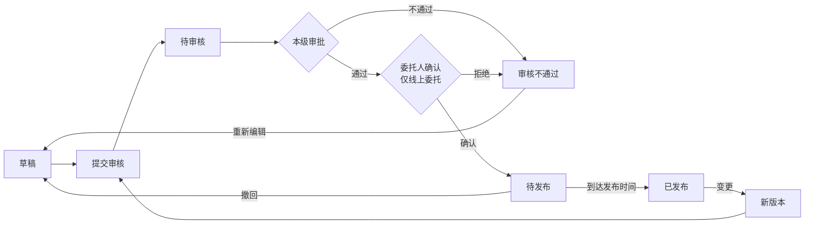

# 发布管理（公告）

> 关联文档：[项目执行总览](README.md)

## 1. 业务流程

### 1.1 公告发布与变更流程




**通用变更规则**：
- 已发布状态变更时保留原版本快照到版本历史子表
- 主表更新为最新版本内容，版本号自增

---

## 2. 数据结构 + 状态值

### 2.1 公告类型自动判定

| 采购方式     | 公告类型 | 供应商称呼 |
| -------- | ---- | ----- |
| 公开招标     | 招标公告 | 投标人   |
| 询比采购（公开） | 询比公告 | 供应商   |
| 谈判采购（公开） | 谈判公告 | 供应商   |
| 竞价（公开）   | 竞价公告 | 供应商   |

### 2.2 公告数据结构

一条公告记录可关联 1~N 个标段（N ≤ 项目中标段总数）。新建公告时默认关联项目内全部未关联过的标段，用户可增删。未被选中的标段后续仍可另行发公告。

公告数据由两部分组成：
- **公告主表**：每条公告一条记录，包含关联项目、关联标段列表、公告信息、采购单位信息、其他相关说明
- **标段公告配置表**（标段包级）：一个标段包对应一条记录，包含时间/竞价参数和供应商要求

```
公告主表（1条记录）
├── 关联项目（只读带入）
├── 公告信息（名称/发布媒体/开始时间/附件）
├── 关联标段列表 ↗┐
├── 采购单位信息 ↗│（只读带入）           每条公告可关联 1~N 个标段
└── 其他相关说明 ↗│                        未关联的标段后续可另行发公告
                  │
标段公告配置表（N条记录，按标段独立配置）
├── 时间字段（招标/询比/谈判）或 竞价参数（竞价）
└── 供应商要求（采购范围/基本/资质/业绩/其他要求）
```

### 2.3 字段定义

#### 公告主表字段（公告级）

**关联项目**（自动带入，只读为主）：

| 字段   | 类型  | 必填  | 来源     | 可编辑 | 说明       |
| ---- | --- | --- | ------ | --- | -------- |
| 项目名称 | 文本  | -   | 自动带入项目 | ❌   |          |
| 项目编号 | 文本  | -   | 自动带入项目 | ❌   |          |
| 项目类型 | 文本  | -   | 自动带入项目 | ❌   | 工程/物资/服务 |
| 采购方式 | 文本  | -   | 自动带入项目 | ❌   |          |
| 行业分类 | 文本  | -   | 自动带入项目 | ❌   | 本项目行业分类  |
| 项目概况 | 文本域 | ❌   | 自动带入项目 | ✅   | 可编辑      |
| 其他   | 文本域 | ❌   | 自动带入项目 | ✅   | 可编辑      |

**公告信息**：

| 字段     | 类型    | 必填  | 来源         | 可编辑 | 说明                            |
| ------ | ----- | --- | ---------- | --- | ----------------------------- |
| 公告名称   | 文本    | ✅   | 自动填充       | ✅   | 默认「项目名称+采购方式+公告」              |
| 公告发布媒体 | 文本/多选 | ✅   | 默认当前租户采购官网 | ✅   | 招标类默认勾选中国招投标公共服务平台            |
| 公告开始时间 | 日期时间  | ✅   | 自动计算       | ✅   | 默认2天后0点，快捷选项：此刻/10分钟/20分钟/半小时 |
| 公告附件   | 文件上传  | ❌   | 手动上传       | ✅   | 支持多个pdf/word/图片               |

**关联标段列表**：

| 字段   | 类型   | 必填  | 来源    | 可编辑 | 说明                           |
| ---- | ---- | --- | ----- | --- | ---------------------------- |
| 关联标段 | 标段多选 | ✅   | 项目标段包 | ✅   | 默认全选未关联标段，支持增删，一条公告可关联1~N个标段 |

**采购单位信息**：

| 字段     | 类型 | 必填 | 来源     | 可编辑 | 说明 |
| -------- | ---- | ---- | -------- | ------ | ---- |
| 采购单位名称 | 文本 | -    | 自动带入 | ❌     |      |
| 采购单位地址 | 文本 | -    | 自动带入 | ❌     |      |
| 联系人     | 文本 | -    | 自动带入 | ❌     |      |
| 联系电话     | 文本 | -    | 自动带入 | ❌     |      |

**其他相关说明**：

| 字段     | 类型  | 必填  | 来源   | 可编辑 | 说明                |
| ------ | --- | --- | ---- | --- | ----------------- |
| 发布媒介说明 | 长文本 | ❌   | 系统模板 | ✅   | 模板文本因采购方式而异       |
| 注册说明   | 长文本 | ❌   | 系统模板 | ✅   | 模板文本因采购方式而异       |
| 标书款支付  | 长文本 | ❌   | 系统模板 | ✅   | 仅公开招标，非招标类无此字段    |
| 平台使用费  | 长文本 | ❌   | 系统模板 | ✅   | 仅询比/谈判/竞价，招标类无此字段 |
| 文件下载   | 长文本 | ❌   | 系统模板 | ✅   | 模板文本因采购方式而异       |
| CA办理   | 长文本 | ❌   | 系统模板 | ✅   | 招标类必须办理，非招标可不办理   |
| 帮助信息   | 长文本 | ❌   | 系统模板 | ✅   | 模板各采购方式一致         |
| 其他信息   | 长文本 | ❌   | 系统模板 | ✅   | 招标类含异议条款，非招标不含    |

**默认填充内容**：

> 以下为系统模板默认填充的长文本内容，均为选填、可编辑。其中 `{当前租户的采购官网}`、`{当前租户的采购官网地址}` 为运行时替换变量。

**招标类（公开招标）**：

- **发布媒介说明**：本次招标公告同时在 `{当前租户的采购官网}`（`{当前租户的采购官网地址}`）和中国招标投标公共服务平台（[www.cebpubservice.com](www.cebpubservice.com)）上发布，对于因其他网站转载并发布的非完整版或修改版公告，而导致损失的情形，招标人及招标代理机构不予承担责任。
- **注册说明**：投标人登录电子采购平台门户网站，点击右上角【用户注册】注册用户账号，填写企业信息提交审核，审核情况将在24小时内（不含法定节假日）进行反馈，审核通过的投标人方可购买/下载招标文件，请合理安排注册时间。
- **标书款支付**：需要支付标书款的项目，投标人登录电子采购平台门户网站，点击右上角【用户登录】-【供应商系统】，在【公告信息-采购公告】或【我的邀请】中选择项目，点击【进入项目】进入工作台，在【招标文件】环节，点击【购买招标文件】进行网上支付，招标方不接受线下支付；标书款发票为增值税电子普通发票，请投标人于购买招标文件5日后在【订单管理】中自行下载、打印。
- **文件下载**：投标人可在【我的项目】中选择项目，点击【进入项目】进入工作台，在【招标文件】环节，点击【下载招标文件】自行下载招标文件电子版，招标方不再提供纸质招标文件。需要支付标书款的项目，标书款支付成功后才可下载。
- **CA办理**：CA数字证书为投标人参与投标的必备身份证明，用于投标文件的签章、加解密。首次办理CA（证书费用200元/年）的投标人须按照电子采购平台门户网站（[https://www.sdicc.com.cn](https://www.sdicc.com.cn)）【帮助中心】→【操作指南】"投标人CA办理操作说明"进行线上办理。如有CA相关问题，投标人可拨打北京数字认证股份有限公司客服热线，010-58515511按0转人工客服。已办理CA的投标人请注意使用时效，过期的须及时完成续期办理（证书费用150元/年），请投标人在投标文件递交截止时间7个工作日前递交CA申办资料，逾期导致投标文件递交不成功的，其后果由投标人自行承担。
- **帮助信息**：如需帮助请登录电子采购平台网站首页【帮助中心】-【操作指南】。
- **其他信息**：本次招标活动所有信息发布和联络以投标注册时填写的信息为准，投标人应对填写的所有信息的真实性和准确性负责，并自行承担信息有误导致的一切后果。对本次招标活动有异议的，可在法律规定时间内通过电子采购平台向招标人或招标代理机构提出，联系方式见本公告。

**非招标类（询比/谈判/竞价）**：

- **发布媒介说明**：本次采购公告同时在 [`{当前租户的采购官网}`](`{当前租户的采购官网地址}`) 上发布，对于因其他网站转载并发布的非完整版或修改版公告，而导致损失的情形，采购人及采购代理机构不予承担责任。
- **注册说明**：供应商登录电子采购平台门户网站，点击右上角【用户注册】注册用户账号，填写企业基本信息提交审核，审核情况将在24小时内（不含法定节假日）进行反馈。基本信息审核通过的供应商，方可下载采购文件，请合理安排注册时间。
- **平台使用费**：供应商若中标，须在取得成交通知书前缴纳平台使用费（收费标准及方式详见门户网站－通知公告或帮助中心－常见问题）。
- **文件下载**：供应商登录电子采购平台门户网站，点击右上角【用户登录】-【供应商系统】，在【公告信息-采购公告】或【我的邀请】中选择项目，点击【进入项目】进入工作台，在【采购文件】环节，点击【下载采购文件】自行下载采购文件电子版，采购方不再提供纸质采购文件。
- **CA办理**：目前非招标项目可不办理ＣＡ。
- **帮助信息**：如需帮助请登录电子采购平台网站首页【帮助中心】-【操作指南】。
- **其他信息**：本次采购活动所有信息发布和联络以注册及参与项目时填写的信息为准，供应商应对填写的所有信息的真实性和准确性负责，并自行承担信息有误导致的一切后果。

**系统字段**：

| 字段       | 类型  | 说明               |
| -------- | --- | ---------------- |
| 公告ID     | 主键  | 系统自动生成           |
| 当前版本号    | 数字  | 版本记录，初始为1，每次变更+1 |
| 公告状态     | 文本  | 见下方状态字典          |
| 创建人/创建时间 | 系统  |                  |
| 更新人/更新时间 | 系统  |                  |

#### 标段公告配置表（标段包级）

按标段/包独立配置，页面通过页签切换。一个标段包对应一条记录。

**关联字段**：

| 字段     | 类型 | 必填 | 来源     | 说明 |
| -------- | ---- | ---- | -------- | ---- |
| 公告ID   | 外键 | 是   | 公告主表 | 关联所属公告 |
| 标段包ID | 外键 | 是   | 项目标段包 | 关联所属标段 |

**时间字段（招标 / 询比 / 谈判适用，竞价不适用）**：

| 字段       | 类型   | 必填  | 来源               | 可编辑 | 说明                  |
| -------- | ---- | --- | ---------------- | --- | ------------------- |
| 文件获取开始时间 | 日期时间 | ✅   | 自动计算（=公告开始时间）    | ✅   | 只能选择公告开始时间之后        |
| 文件获取截止时间 | 日期时间 | ✅   | 自动计算             | ✅   | 招标默认+5天，询比/谈判默认+3天  |
| 澄清截止时间   | 日期时间 | ✅   | 自动计算             | ✅   | 招标默认+6天，询比/谈判默认+3天  |
| 截标/开标时间  | 日期时间 | ✅   | 自动计算             | ✅   | 招标默认+21天，询比/谈判默认+5天 |
| 标书获取地点   | 文本   | ✅   | 自动带入（当前租户采购官网）   | ❌   |                     |
| 开标地点     | 文本   | ✅   | 自动带入（当前租户采购官网名称） | ✅   |                     |

**竞价参数字段（仅竞价适用，带入标段包配置，只读）**：

| 字段       | 类型   | 必填  | 来源    | 可编辑 | 说明  |
| -------- | ---- | --- | ----- | --- | --- |
| 竞价开始时间   | 日期时间 | ✅   | 带入标段包 | ✅   |     |
| 竞价类型     | 文本   | ✅   | 带入标段包 | ❌   |     |
| 延时方式     | 文本   | ✅   | 带入标段包 | ❌   |     |
| 竞价时长（分钟） | 数字   | ✅   | 带入标段包 | ❌   |     |
| 延时时长（分钟） | 数字   | ✅   | 带入标段包 | ❌   |     |
| 起拍价（元）   | 数字   | ✅   | 带入标段包 | ❌   |     |
| 价格梯度（元）  | 数字   | ✅   | 带入标段包 | ❌   |     |

**供应商要求（全部采购方式）**：

| 字段              | 类型  | 必填  | 来源    | 可编辑 | 说明  |
| --------------- | --- | --- | ----- | --- | --- |
| 采购范围            | 文本域 | ✅   | 带入标段包 | ✅   |     |
| 供应商基本要求         | 文本域 | ✅   | 带入标段包 | ✅   |     |
| 供应商资质要求         | 文本域 | ✅   | 带入标段包 | ✅   |     |
| 供应商业绩要求         | 文本域 | ✅   | 带入标段包 | ✅   |     |
| 供应商其他要求         | 文本域 | ✅   | 带入标段包 | ✅   |     |
| 供应商拟投入项目负责人最低要求 | 长文本 | ❌   | 带入标段包 | ✅   |     |
| 备注              | 长文本 | ❌   | -     | ✅   | 选填  |

**级联时间默认值规则**：

以**公告开始时间**为基准锚点，上述时间字段按级联关系自动计算默认值：

```
公告开始时间（基准，来自公告主表）
    │
    ├─→ 文件获取开始时间（默认 = 公告开始时间，只能选择之后的时间）
    │       │
    │       └─→ 文件获取截止时间（默认 = 公告开始时间 + N天）
    │               │
    │               └─→ 澄清截止时间（默认 = 公告开始时间 + M天，≥ 文件获取截止时间）
    │                       │
    │                       └─→ 截标/开标时间（默认 = 公告开始时间 + K天，≥ 澄清截止时间）
```

**各采购方式默认偏移量**：

| 时间字段 | 公开招标 | 询比/谈判 |
|---------|---------|----------|
| 文件获取开始时间 | +0天 | +0天 |
| 文件获取截止时间 | +5天 | +3天 |
| 澄清截止时间 | +6天 | +3天 |
| 截标/开标时间 | +21天 | +5天 |

**校验规则**：
- 文件获取开始时间 ≥ 公告开始时间
- 文件获取截止时间 ≥ 文件获取开始时间
- 澄清截止时间 ≥ 文件获取截止时间
- 截标/开标时间 ≥ 澄清截止时间
- 以上校验在提交审核时执行，校验失败滚动定位到对应字段

### 2.4 公告版本历史子表

| 字段                            | 类型   | 必填  | 说明                                                 |
| ----------------------------- | ---- | --- | -------------------------------------------------- |
| 序号（version_history_id）        | 自增主键 | ✅   | 版本记录唯一标识                                           |
| 公告ID（announcement_id）         | 外键   | ✅   | 关联公告主表                                             |
| 版本号（version_number）           | 数字   | ✅   | 版本序号，初始为1，每次变更+1                                   |
| 变更原因（change_reason）          | 长文本  | ❌   | 变更原因说明                                             |
| 公告主表快照（announcement_snapshot） | JSON | ✅   | 完整快照：项目信息、公告信息、采购单位信息、其他相关说明                       |
| 标段配置快照（sections_snapshot）     | JSON | ✅   | 完整快照：关联标段列表及各标段的时间字段/竞价参数/供应商要求                    |
| 修改人（modified_by）              | 用户ID | ✅   | 发起变更的用户                                            |
| 修改时间（modified_at）             | 日期时间 | ✅   | 变更提交时间                                             |


### 2.5 状态字典

**公告主表状态**：

| 状态    | 状态码                 | 说明          | 允许操作           |
| ----- | ------------------- | ----------- | -------------- |
| 草稿    | `DRAFT`             | 编制中         | 编辑、提交审核、删除     |
| 待审核   | `PENDING_APPROVAL`  | 已提交，审核中     | 查看、撤回（审核组件留记录） |
| 审核不通过 | `APPROVAL_REJECTED` | 审核拒绝        | 编辑、提交审核、删除     |
| 待发布   | `APPROVED`          | 审批通过，未到发布时间 | 撤回、查看         |
| 已发布   | `PUBLISHED`         | 到达发布时间，对外可见 | 查看、变更（新版本重新送审） |


---

## 3. 页面设计

### 3.1 公告信息展示区

**功能路径**：
- `采购系统 → 项目管理 → 我的项目 → 进入项目`
- `采购系统 → 项目管理 → 我的工作台 → 进入项目`

**页面结构**：

页面顶部为采购流程步骤页签，切换至"发布公告"页签后，下方展示公告信息卡片。

```
┌─ 项目详情页 ─────────────────────────────────────────────────────────────────┐
│  XX项目（标段A）                                                            │
│                                                                             │
│  [发布公告]  [采购文件]  [标前准备]  [开标]  [评标]  [定标]  [标后]          │
│  ─────────────────────────────────────────────────────────────────────      │
│                                                                             │
│  ┌─────────────────────────────────────────────────────────────────────┐   │
│  │ 公告名称    │ XX项目公开招标招标公告                                  │   │
│  │ 项目类型    │ 工程                                                     │   │
│  │ 公告状态    │ 已发布                                                   │   │
│  │ 行业分类    │ 工业                                                     │   │
│  │ 采购方式    │ 公开招标                                                 │   │
│  │ 变更次数    │ 2次                                                     │   │
│  │ 公告开始时间 │ 2026-06-15 00:00                                       │   │
│  └─────────────────────────────────────────────────────────────────────┘   │
│                                                                             │
│  ┌─────────────────────────────────────────────────────────────────────┐   │
│  │                     [编辑]  [提交审核]  [查看历史公告]               │   │
│  └─────────────────────────────────────────────────────────────────────┘   │
│                                                                             │
└─────────────────────────────────────────────────────────────────────────────┘
```

**字段说明**：公告名称、项目类型、公告状态、行业分类、采购方式、变更次数、公告开始时间。

**操作按钮（与公告状态联动）**：

| 公告状态 | 操作按钮 |
|---------|---------|
| 草稿 | [编辑] [提交审核] [查看历史公告] |
| 待审核 | [撤回] [查看历史公告] |
| 审核不通过 | [编辑] [提交审核] [查看历史公告] |
| 待发布 | [撤回] [查看历史公告] |
| 已发布 | [变更] [查看历史公告] |

### 3.2 新建/编辑公告页

**触发方式**：项目详情页发布公告卡片点击 [新建] 或 [编辑]

**页面模块顺序**：项目信息 → 公告信息 → 关联标段 → 标段/包信息 → 采购单位信息 → 其他相关说明

```
┌─ 新建公告（公开招标示例）──────────────────────────────────────────────────┐
│  [返回]                                                                   │
│                                                                            │
│  ▾ ① 项目信息                                                              │
│  ┌─────────────────────────────────────────────────────────────────────┐  │
│  │ 项目名称    │ XX项目                                    （只读）       │  │
│  │ 项目编号    │ XXXX                                      （只读）       │  │
│  │ 项目类型    │ 工程                                      （只读）       │  │
│  │ 采购方式    │ 公开招标                                    （只读）       │  │
│  │ 行业分类    │ 工业                                      （只读）       │  │
│  │ 项目概况    │ ┌───────────────────────────────────────────┐（可编辑）   │  │
│  │             │                                           │          │  │
│  │             └───────────────────────────────────────────┘          │  │
│  │ 其他        │ ┌───────────────────────────────────────────┐（可编辑）   │  │
│  │             │                                           │          │  │
│  │             └───────────────────────────────────────────┘          │  │
│  └─────────────────────────────────────────────────────────────────────┘  │
│                                                                            │
│  ▾ ② 公告信息                                                              │
│  ┌─────────────────────────────────────────────────────────────────────┐  │
│  │ * 公告名称      │ XX项目公开招标招标公告                              │  │
│  │ * 公告发布媒体  │ ☑ 采购官网  ☑ 中国招投标公共服务平台               │  │
│  │ * 公告开始时间  │ [ 2026-06-17 00:00 ]                               │  │
│  │                 │ 快捷：[此刻] [10分钟] [20分钟] [半小时]            │  │
│  │   公告附件      │ [ 上传文件 ]  支持pdf/word/图片                    │  │
│  └─────────────────────────────────────────────────────────────────────┘  │
│                                                                            │
│  ▾ ③ 关联标段                                                              │
│  ┌─────────────────────────────────────────────────────────────────────┐  │
│  │ [ 标段A ✓ ] [ 标段B ✓ ] [ 标段C  ] [ + 添加 ]                      │  │
│  │ 默认全选未关联标段，支持增删，一条公告可关联1~N个标段                 │  │
│  └─────────────────────────────────────────────────────────────────────┘  │
│                                                                            │
│  ▾ ④ 标段/包信息                                                          │
│  ┌─ 标段A ────── 标段B ──────────────────────────────────────────────┐  │
│  │                                                                      │  │
│  │  时间字段                                                            │  │
│  │  * 文件获取开始时间  │ [ 2026-06-17 00:00 ]  （默认=公告开始时间）   │  │
│  │  * 文件获取截止时间  │ [ 2026-06-22 00:00 ]  （默认+5天）           │  │
│  │  * 澄清截止时间      │ [ 2026-06-23 00:00 ]  （默认+6天）           │  │
│  │  * 截标/开标时间     │ [ 2026-07-08 00:00 ]  （默认+21天）          │  │
│  │  * 标书获取地点      │ XX采购官网                          （只读）     │  │
│  │  * 开标地点          │ ┌───────────────────┐            （可编辑）      │  │
│  │                      │                   │                         │  │
│  │                      └───────────────────┘                         │  │
│  │                                                                      │  │
│  │  供应商要求                                                          │  │
│  │  * 采购范围          │ ┌───────────────────────────────────────┐      │  │
│  │                        │                                       │      │  │
│  │                        └───────────────────────────────────────┘    │  │
│  │  * 供应商基本要求    │ ┌───────────────────────────────────────┐      │  │
│  │                        │                                       │      │  │
│  │                        └───────────────────────────────────────┘    │  │
│  │  * 供应商资质要求    │ ┌───────────────────────────────────────┐      │  │
│  │                        │                                       │      │  │
│  │                        └───────────────────────────────────────┘    │  │
│  │  * 供应商业绩要求    │ ┌───────────────────────────────────────┐      │  │
│  │                        │                                       │      │  │
│  │                        └───────────────────────────────────────┘    │  │
│  │  * 供应商其他要求    │ ┌───────────────────────────────────────┐      │  │
│  │                        │                                       │      │  │
│  │                        └───────────────────────────────────────┘    │  │
│  │    项目负责人最低要求 │ ┌───────────────────────────────────────┐      │  │
│  │                        │                                       │      │  │
│  │                        └───────────────────────────────────────┘    │  │
│  │    备注              │ ┌───────────────────────────────────────┐      │  │
│  │                        │                                       │      │  │
│  │                        └───────────────────────────────────────┘    │  │
│  └─────────────────────────────────────────────────────────────────────┘  │
│                                                                            │
│  ▾ ⑤ 采购单位信息                                                          │
│  ┌─────────────────────────────────────────────────────────────────────┐  │
│  │ 采购单位名称 │ XXX公司                                    （只读）       │  │
│  │ 采购单位地址 │ XXX市XXX区XXX路                          （只读）       │  │
│  │ 联系人       │ 李四                                      （只读）       │  │
│  │ 联系电话     │ 138XXXXXXXX                              （只读）       │  │
│  └─────────────────────────────────────────────────────────────────────┘  │
│                                                                            │
│  ▾ ⑥ 其他相关说明                                                          │
│  ┌─────────────────────────────────────────────────────────────────────┐  │
│  │ 发布媒介说明  │ ┌───────────────────────────────────────────┐          │  │
│  │               │                                            │          │  │
│  │               └───────────────────────────────────────────┘          │  │
│  │ 注册说明      │ ┌───────────────────────────────────────────┐          │  │
│  │               │                                            │          │  │
│  │               └───────────────────────────────────────────┘          │  │
│  │ 标书款支付    │ ┌───────────────────────────────────────────┐          │  │
│  │               │                                            │          │  │
│  │               └───────────────────────────────────────────┘          │  │
│  │ 文件下载      │ ┌───────────────────────────────────────────┐          │  │
│  │               │                                            │          │  │
│  │               └───────────────────────────────────────────┘          │  │
│  │ CA办理        │ ┌───────────────────────────────────────────┐          │  │
│  │               │                                            │          │  │
│  │               └───────────────────────────────────────────┘          │  │
│  │ 帮助信息      │ ┌───────────────────────────────────────────┐          │  │
│  │               │                                            │          │  │
│  │               └───────────────────────────────────────────┘          │  │
│  │ 其他信息      │ ┌───────────────────────────────────────────┐          │  │
│  │               │                                            │          │  │
│  │               └───────────────────────────────────────────┘          │  │
│  └─────────────────────────────────────────────────────────────────────┘  │
│                                                                            │
│  [ 保存草稿 ]  [ 提交审核 ]                                                │
│                                                                            │
└────────────────────────────────────────────────────────────────────────────┘
```

**标段/包信息（竞价示例）**：

```
┌─ 标段C（竞价方式）──────────────────────────────────────────────────┐
│                                                                      │
│  竞价参数（带入标段包配置）                                           │
│  * 竞价开始时间   │ [ 2026-06-17 00:00 ]                            │
│    竞价类型       │ 网上竞价                            （只读）        │
│    延时方式       │ 自动延时                            （只读）        │
│    竞价时长       │ 30分钟                              （只读）        │
│    延时时长       │ 5分钟                               （只读）        │
│    起拍价         │ 100,000.00元                        （只读）        │
│    价格梯度       │ 500元                               （只读）        │
│                                                                      │
│  供应商要求                                                          │
│  * 采购范围          │ ┌───────────────────────────────────────┐      │
│                        │                                       │      │
│                        └───────────────────────────────────────┘    │
│  * 供应商基本要求    │ ┌───────────────────────────────────────┐      │
│                        │                                       │      │
│                        └───────────────────────────────────────┘    │
│  ...（其余供应商要求字段同上）                                          │
└──────────────────────────────────────────────────────────────────────┘
```

**交互逻辑**：

| 操作       | 行为                                                         |
| -------- | ---------------------------------------------------------- |
| 进入新建页    | 自动带出项目信息/采购单位信息；默认关联全部未关联标段；公告名称默认填充；各标段时间默认填充；模板文本按采购方式填充 |
| 修改关联标段列表 | 添加/删除标段，④标段/包信息页签同步增删对应标段Tab                               |
| 修改公告开始时间 | ④中时间字段同步更新默认值                                              |
| 切换标段Tab  | 标段/包信息页签展示对应标段的配置信息                                        |
| 点击保存草稿   | 校验公告名称、公告开始时间、已选标段必填项，保存后状态为草稿                             |
| 点击提交审核   | 校验全部必填项+级联时间规则，校验通过后进入待审核                                  |
| 校验失败     | 滚动定位到对应字段并提示错误                                             |

**按采购方式联动差异**：

| 采购方式 | 发布媒体 | 标段/包信息字段 | 模板文本 |
|---------|----------|-------------|----------|
| 公开招标 | 采购官网 + 中国招投标公共服务平台 | 时间字段（+5/+6/+21天） + 通用字段 | 招标类模板 |
| 询比/谈判 | 仅采购官网 | 时间字段（+3/+3/+5天） + 通用字段 | 非招标类模板 |
| 竞价 | 仅采购官网 | 竞价参数字段（只读带入） + 通用字段 | 非招标类模板 |

### 3.3 查看历史公告（弹窗）

**触发方式**：项目详情页发布公告卡片点击 [查看历史公告] 按钮

**弹窗内容**：

```
┌─ 历史公告 ───────────────────────────────────────────┐
│                                                       │
│  序号    公告名称              变更时间        操作     │
│ ───────────────────────────────────────────────────── │
│  1      XX工程招标公告(v2)   2026-06-20     [查看]    │
│  2      XX工程招标公告(v1)   2026-06-15     [查看]    │
│                                                       │
│                                              [关闭]    │
└───────────────────────────────────────────────────────┘
```

**字段说明**：

| 字段 | 说明 | 数据来源 |
|------|------|---------|
| 序号 | 版本历史记录序号 | 版本历史子表 version_history_id |
| 公告名称 | 该版本的公告名称（带版本号）| 版本历史子表 announcement_snapshot.公告名称 |
| 变更时间 | 变更创建时间 | 版本历史子表 modified_at |
| 操作 | [查看] 按钮 | 点击查看该版本快照详情 |

**快照详情弹窗**：
- 点击 [查看] 后打开新弹窗/抽屉，展示该版本的完整快照内容
- 展示字段与公告详情页一致（只读模式），包含项目信息、公告信息、采购单位信息、其他相关说明、标段公告配置
- 底部显示变更原因（如有）

### 3.4 变更操作

**触发方式**：项目详情页发布公告卡片（已发布状态）点击 [变更]

**页面结构**：与新建/编辑公告页一致的6个模块（项目信息 → 公告信息 → 关联标段 → 标段/包信息 → 采购单位信息 → 其他相关说明 + 变更内容），差异如下：

**模块差异**：
- ② **公告信息**：公告开始时间 → 只读，其他字段可编辑（同新增）
- ③ **关联标段**：只读展示，禁止增删
- ⑥ **其他相关说明**：最后追加"变更内容"模块
- 按钮置于页面顶部

```
┌─ 变更公告 — XX项目公开招标招标公告（第2次变更）
│  [取消变更]  [保存]  [提交审核]                                    ──── 顶部按钮
│
│  ▾ ① 项目信息（同新增，略）
│  ▾ ② 公告信息                                                         │
│  ┌─────────────────────────────────────────────────────────────────┐ │
│  │ * 公告名称    │ XX项目公开招标招标公告                           │ │
│  │ * 公告发布媒体│ ☑ 采购官网  ☑ 中国招投标公共服务平台            │ │
│  │   公告开始时间 │ 2026-06-15 00:00                    （只读）      │ │
│  │   公告附件    │ 已上传.pdf                           （可编辑）    │ │
│  └─────────────────────────────────────────────────────────────────┘ │
│  ▾ ③ 关联标段（只读展示）                                              │
│  ┌─────────────────────────────────────────────────────────────────┐ │
│  │ [ 标段A ✓ ] [ 标段B ✓ ]                                        │ │
│  └─────────────────────────────────────────────────────────────────┘ │
│  ▾ ④ 标段/包信息（同新增，略）                                         │
│  ▾ ⑤ 采购单位信息（同新增，略）                                         │
│  ▾ ⑥ 其他相关说明  （同新增，略）                                                 
│  ▾ 变更内容                                                             │
│  ┌─────────────────────────────────────────────────────────────────┐ │
│  │ XX项目公开招标招标公告（第2次变更）                               │ │
│  │ ────────────────────────────────────────────────                │ │
│  │ 标段：标段A                                                      │ │
│  │  字段：截标/开标时间                                              │ │
│  │  原内容：2026-07-08 00:00                                       │ │
│  │  变更为：2026-07-15 00:00  （红色）                              │ │
│  │                                                                  │ │
│  │ 标段：标段B                                                      │ │
│  │  字段：供应商资质要求                                              │ │
│  │  原内容：具备XXX资质                                              │ │
│  │  变更为：具备XXX资质和YYY资质  （红色）                            │ │
│  │                                                                  │ │
│  │ （变更内容实时更新，仅追踪标段/包信息字段变更）                      │ │
│  └─────────────────────────────────────────────────────────────────┘ │
│                                                                         │
└─────────────────────────────────────────────────────────────────────────┘
```

**变更内容模块规则**：

| 规则 | 说明 |
|------|------|
| 标题 | 公告名称（第x次变更），x=当前版本号-1 |
| 数据来源 | 页面打开时前端缓存当前版本快照数据，后续实时对比差异 |
| 追踪范围 | 仅追踪 **标段/包信息** 中标段的时间字段、竞价参数、供应商要求变更 |
| 显示格式 | `标段：XXX` <br> `字段：XXX` <br> `原内容：XXX` <br> `变更为：XXX（红色显示）` |
| 触发时机 | 用户编辑标段/包信息字段时实时更新，未修改不显示 |
| 无变更时 | 提示"暂无变更信息" |


**交互逻辑**：

| 操作         | 行为                       |
| ---------- | ------------------------ |
| 进入页面       | 自动带出当前公告内容；前端缓存当前版本快照    |
| 修改标段/包信息字段 | 实时对比快照，更新变更内容模块          |
| 点击取消变更     | 不提示，直接返回项目详情页，不保存        |
| 点击保存       | 保存当前编辑内容，不提交审核，变更内容模块保持  |
| 点击提交审核     | 校验后提交审核，进入待审核                                  |

---

## 4. 审批流程

| 业务 | 审批路径 | 说明 |
|------|---------|------|
| 公告发布 | 本级审批 → 委托人确认（仅线上委托） | 全部审核节点通过后进入待发布状态 |
| 公告变更 | 同公告发布 | 变更后的新版本需重新走完整审批流程 |

**审批说明**：
- 线上委托场景下，审批通过后还需委托人（即采购立项创建人）确认
- 自采场景本级审批通过后直接进入待发布状态
- 待审核状态可撤回，审核组件留下撤回记录，状态变为草稿
- 审批通过后状态变为「待发布」
- 系统定时检查发布时间，到达发布时间后自动变为「已发布」
- 发布时间必须晚于当前时间（提交审核时校验）。若审核期间发布时间已过（早于当前时间），审批通过后变更为草稿状态
- 变更审核须在截标/开标时间前完成。审核通过时若已到达或超过截标/开标时间（≥ 截标/开标时间），系统提示"已超过截标/开标时间，变更无法生效"，只能选择审核不通过；竞价方式以竞价开始时间为准
- 变更审核期间，原公告继续对外展示；新版本审核通过并生效后替换原内容
- 变更审核不通过时，版本号/变更次数不增加，不写入版本历史；审核通过后版本号+1并写入版本历史子表

---

## 5. 待确认问题

| #   | 问题                                                                | 状态  |
| --- | ----------------------------------------------------------------- | --- |
| 1   | 级联时间默认值按自然日还是工作日计算？                                               | 待确认 |
| 2   | 公告的维度是项目级还是标段级？当前设计为公告级（一条公告可关联 1~N 个标段），编辑公告时可增删关联标段，未关联的标段后续可另行发公告。 | 待确认 |
| 3   | 采购公告和采购文件在招标人确认环节，具体由哪个角色/用户来确认？                                  | 待确认 |
| 4   | 公告开始时间和文件获取开始时间是否必须一致？当前系统未做此项校验，是否需要补充？                          | 待确认 |
| 5   | 公告变更已发布后，原公告是暂停显示还是直接替换？新版本生效期间已报名的供应商如何处理？                    | 已确认：变更期间继续展示原公告，新版本生效后替换 |
| 6   | 公告变更是否需要走本级审核和招标人确认流程？如果变更了文件获取截止时间，但审核流程未能在截止时间前完成，如何处理？        | 已确认：变更须走完整审批流程；审核通过时若 ≥ 截标/开标时间，只能审核不通过 |
| 7   | 测试环境存在 Bug：公告开始时间未到，但状态已显示为"已发布"。需确认期望行为是到达发布时间才变为已发布。            | 需修复 |
| 8   | 踏勘现场安排在哪个环节？是否需要纳入招标公告的内容中展示？                                    | 待确认 |
| 9   | 线上委托场景下，委托人拒绝后如何处理？公告是否需要允许重新编辑提交？                                 | 待确认 |
| 10  | 公告变更期间（审核中），原公告是否继续对外显示？                                            | 已确认：变更期间继续展示原公告 |
| 11  | 公告变更审核不通过时，变更次数（版本号）是否不增加？                                          | 已确认：审核不通过不增加，仅通过后+1 |
