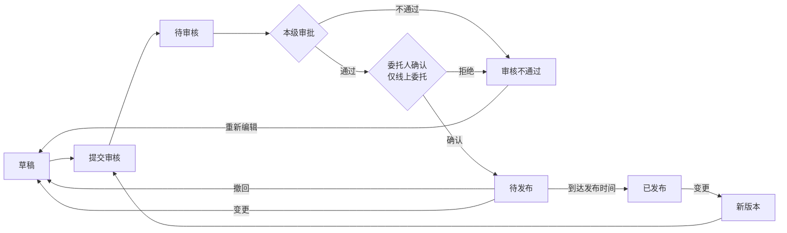

# 发布管理（公告）

> 关联文档：[项目执行总览](README.md)

## 1. 业务流程

### 1.1 公告发布与变更流程




**通用变更规则**：
- 变更时保留原版本快照到版本历史子表
- 主表更新为最新版本内容，版本号自增

---

## 2. 数据结构 + 状态值

### 2.1 公告类型自动判定

| 采购方式     | 公告类型 | 供应商称呼 |
| -------- | ---- | ----- |
| 公开招标     | 招标公告 | 投标人   |
| 询比采购（公开） | 询比公告 | 供应商   |
| 谈判采购（公开） | 谈判公告 | 供应商   |
| 竞价（公开）   | 竞价公告 | 供应商   |

### 2.2 公告数据结构

一条公告记录可关联 1~N 个标段（N ≤ 项目中标段总数）。新建公告时默认关联项目内全部未关联过的标段，用户可增删。未被选中的标段后续仍可另行发公告。

公告数据由两部分组成：
- **公告主表**：每条公告一条记录，包含关联项目、关联标段列表、公告信息、采购单位信息、其他相关说明
- **标段公告配置表**（标段包级）：一个标段包对应一条记录，包含时间/竞价参数和供应商要求

```
公告主表（1条记录）
├── 关联项目（只读带入）
├── 公告信息（名称/发布媒体/开始时间/附件）
├── 关联标段列表 ↗┐
├── 采购单位信息 ↗│（只读带入）           每条公告可关联 1~N 个标段
└── 其他相关说明 ↗│                        未关联的标段后续可另行发公告
                  │
标段公告配置表（N条记录，按标段独立配置）
├── 时间字段（招标/询比/谈判）或 竞价参数（竞价）
└── 供应商要求（采购范围/基本/资质/业绩/其他要求）
```

### 2.3 字段定义

#### 公告主表字段（公告级）

**关联项目**（自动带入，只读为主）：

| 字段   | 类型  | 必填  | 来源     | 可编辑 | 说明       |
| ---- | --- | --- | ------ | --- | -------- |
| 项目名称 | 文本  | -   | 自动带入项目 | ❌   |          |
| 项目编号 | 文本  | -   | 自动带入项目 | ❌   |          |
| 项目类型 | 文本  | -   | 自动带入项目 | ❌   | 工程/物资/服务 |
| 采购方式 | 文本  | -   | 自动带入项目 | ❌   |          |
| 行业分类 | 文本  | -   | 自动带入项目 | ❌   | 本项目行业分类  |
| 项目概况 | 文本域 | ❌   | 自动带入项目 | ✅   | 可编辑      |
| 其他   | 文本域 | ❌   | 自动带入项目 | ✅   | 可编辑      |

**公告信息**：

| 字段     | 类型    | 必填  | 来源         | 可编辑 | 说明                            |
| ------ | ----- | --- | ---------- | --- | ----------------------------- |
| 公告名称   | 文本    | ✅   | 自动填充       | ✅   | 默认「项目名称+采购方式+公告」              |
| 公告发布媒体 | 文本/多选 | ✅   | 默认当前租户采购官网 | ✅   | 招标类默认勾选中国招投标公共服务平台            |
| 公告开始时间 | 日期时间  | ✅   | 自动计算       | ✅   | 默认2天后0点，快捷选项：此刻/10分钟/20分钟/半小时 |
| 公告附件   | 文件上传  | ❌   | 手动上传       | ✅   | 支持多个pdf/word/图片               |

**关联标段列表**：

| 字段   | 类型   | 必填  | 来源    | 可编辑 | 说明                           |
| ---- | ---- | --- | ----- | --- | ---------------------------- |
| 关联标段 | 标段多选 | ✅   | 项目标段包 | ✅   | 默认全选未关联标段，支持增删，一条公告可关联1~N个标段 |

**采购单位信息**：

| 字段     | 类型 | 必填 | 来源     | 可编辑 | 说明 |
| -------- | ---- | ---- | -------- | ------ | ---- |
| 采购单位名称 | 文本 | -    | 自动带入 | ❌     |      |
| 采购单位地址 | 文本 | -    | 自动带入 | ❌     |      |
| 联系人     | 文本 | -    | 自动带入 | ❌     |      |
| 联系电话     | 文本 | -    | 自动带入 | ❌     |      |

**其他相关说明**：

| 字段     | 类型  | 必填  | 来源   | 可编辑 | 说明                |
| ------ | --- | --- | ---- | --- | ----------------- |
| 发布媒介说明 | 长文本 | ❌   | 系统模板 | ✅   | 模板文本因采购方式而异       |
| 注册说明   | 长文本 | ❌   | 系统模板 | ✅   | 模板文本因采购方式而异       |
| 标书款支付  | 长文本 | ❌   | 系统模板 | ✅   | 仅公开招标，非招标类无此字段    |
| 平台使用费  | 长文本 | ❌   | 系统模板 | ✅   | 仅询比/谈判/竞价，招标类无此字段 |
| 文件下载   | 长文本 | ❌   | 系统模板 | ✅   | 模板文本因采购方式而异       |
| CA办理   | 长文本 | ❌   | 系统模板 | ✅   | 招标类必须办理，非招标可不办理   |
| 帮助信息   | 长文本 | ❌   | 系统模板 | ✅   | 模板各采购方式一致         |
| 其他信息   | 长文本 | ❌   | 系统模板 | ✅   | 招标类含异议条款，非招标不含    |

**系统字段**：

| 字段       | 类型  | 说明               |
| -------- | --- | ---------------- |
| 公告ID     | 主键  | 系统自动生成           |
| 当前版本号    | 数字  | 版本记录，初始为1，每次变更+1 |
| 公告状态     | 文本  | 见下方状态字典          |
| 创建人/创建时间 | 系统  |                  |
| 更新人/更新时间 | 系统  |                  |

#### 标段公告配置表（标段包级）

按标段/包独立配置，页面通过页签切换。一个标段包对应一条记录。

**关联字段**：

| 字段     | 类型 | 必填 | 来源     | 说明 |
| -------- | ---- | ---- | -------- | ---- |
| 公告ID   | 外键 | 是   | 公告主表 | 关联所属公告 |
| 标段包ID | 外键 | 是   | 项目标段包 | 关联所属标段 |

**时间字段（招标 / 询比 / 谈判适用，竞价不适用）**：

| 字段       | 类型   | 必填  | 来源               | 可编辑 | 说明                  |
| -------- | ---- | --- | ---------------- | --- | ------------------- |
| 文件获取开始时间 | 日期时间 | ✅   | 自动计算（=公告开始时间）    | ✅   | 只能选择公告开始时间之后        |
| 文件获取截止时间 | 日期时间 | ✅   | 自动计算             | ✅   | 招标默认+5天，询比/谈判默认+3天  |
| 澄清截止时间   | 日期时间 | ✅   | 自动计算             | ✅   | 招标默认+6天，询比/谈判默认+3天  |
| 截标/开标时间  | 日期时间 | ✅   | 自动计算             | ✅   | 招标默认+21天，询比/谈判默认+5天 |
| 标书获取地点   | 文本   | ✅   | 自动带入（当前租户采购官网）   | ❌   |                     |
| 开标地点     | 文本   | ✅   | 自动带入（当前租户采购官网名称） | ✅   |                     |

**竞价参数字段（仅竞价适用，带入标段包配置，只读）**：

| 字段       | 类型   | 必填  | 来源    | 可编辑 | 说明  |
| -------- | ---- | --- | ----- | --- | --- |
| 竞价开始时间   | 日期时间 | ✅   | 带入标段包 | ✅   |     |
| 竞价类型     | 文本   | ✅   | 带入标段包 | ❌   |     |
| 延时方式     | 文本   | ✅   | 带入标段包 | ❌   |     |
| 竞价时长（分钟） | 数字   | ✅   | 带入标段包 | ❌   |     |
| 延时时长（分钟） | 数字   | ✅   | 带入标段包 | ❌   |     |
| 起拍价（元）   | 数字   | ✅   | 带入标段包 | ❌   |     |
| 价格梯度（元）  | 数字   | ✅   | 带入标段包 | ❌   |     |

**供应商要求（全部采购方式）**：

| 字段              | 类型  | 必填  | 来源    | 可编辑 | 说明  |
| --------------- | --- | --- | ----- | --- | --- |
| 采购范围            | 文本域 | ✅   | 带入标段包 | ✅   |     |
| 供应商基本要求         | 文本域 | ✅   | 带入标段包 | ✅   |     |
| 供应商资质要求         | 文本域 | ✅   | 带入标段包 | ✅   |     |
| 供应商业绩要求         | 文本域 | ✅   | 带入标段包 | ✅   |     |
| 供应商其他要求         | 文本域 | ✅   | 带入标段包 | ✅   |     |
| 供应商拟投入项目负责人最低要求 | 长文本 | ❌   | 带入标段包 | ✅   |     |
| 备注              | 长文本 | ❌   | -     | ✅   | 选填  |

**级联时间默认值规则**：

以**公告开始时间**为基准锚点，上述时间字段按级联关系自动计算默认值：

```
公告开始时间（基准，来自公告主表）
    │
    ├─→ 文件获取开始时间（默认 = 公告开始时间，只能选择之后的时间）
    │       │
    │       └─→ 文件获取截止时间（默认 = 公告开始时间 + N天）
    │               │
    │               └─→ 澄清截止时间（默认 = 公告开始时间 + M天，≥ 文件获取截止时间）
    │                       │
    │                       └─→ 截标/开标时间（默认 = 公告开始时间 + K天，≥ 澄清截止时间）
```

**各采购方式默认偏移量**：

| 时间字段 | 公开招标 | 询比/谈判 |
|---------|---------|----------|
| 文件获取开始时间 | +0天 | +0天 |
| 文件获取截止时间 | +5天 | +3天 |
| 澄清截止时间 | +6天 | +3天 |
| 截标/开标时间 | +21天 | +5天 |

**校验规则**：
- 文件获取开始时间 ≥ 公告开始时间
- 文件获取截止时间 ≥ 文件获取开始时间
- 澄清截止时间 ≥ 文件获取截止时间
- 截标/开标时间 ≥ 澄清截止时间
- 以上校验在提交审核时执行，校验失败滚动定位到对应字段

### 2.4 公告版本历史子表

| 字段                            | 类型   | 必填  | 说明                                                 |
| ----------------------------- | ---- | --- | -------------------------------------------------- |
| 序号（version_history_id）        | 自增主键 | ✅   | 版本记录唯一标识                                           |
| 公告ID（announcement_id）         | 外键   | ✅   | 关联公告主表                                             |
| 版本号（version_number）           | 数字   | ✅   | 版本序号，初始为1，每次变更+1                                   |
| 变更原因（change_reason）          | 长文本  | ❌   | 变更原因说明                                             |
| 公告主表快照（announcement_snapshot） | JSON | ✅   | 完整快照：项目信息、公告信息、采购单位信息、其他相关说明                       |
| 标段配置快照（sections_snapshot）     | JSON | ✅   | 完整快照：关联标段列表及各标段的时间字段/竞价参数/供应商要求                    |
| 修改人（modified_by）              | 用户ID | ✅   | 发起变更的用户                                            |
| 修改时间（modified_at）             | 日期时间 | ✅   | 变更提交时间                                             |

**JSON快照结构**：

`announcement_snapshot`：
```json
{
  "project_info": { "项目名称", "项目编号", "项目类型", "采购方式", "行业分类", "项目概况", "其他" },
  "announcement_info": { "公告名称", "公告发布媒体": [], "公告开始时间", "公告附件": [] },
  "related_sections": [标段ID列表],
  "purchaser_info": { "采购单位名称", "采购单位地址", "联系人", "联系电话" },
  "other_info": { "发布媒介说明", "注册说明", "标书款支付", "平台使用费", "文件下载", "CA办理", "帮助信息", "其他信息" }
}
```

`sections_snapshot`：
```json
[
  {
    "section_id": 1,
    "section_name": "标段A",
    "time_fields": { "文件获取开始时间", "文件获取截止时间", "澄清截止时间", "截标/开标时间", "标书获取地点", "开标地点" },
    "bidding_params": { "竞价开始时间", "竞价类型", "延时方式", "竞价时长", "延时时长", "起拍价", "价格梯度" },
    "supplier_requirements": { "采购范围", "供应商基本要求", "供应商资质要求", "供应商业绩要求", "供应商其他要求", "供应商拟投入项目负责人最低要求", "备注" }
  }
]
```

**设计说明**：
- 只有**已发布状态的变更**才会生成版本快照写入子表，其他状态变更不写入
- 快照采用 JSON 格式存储，完整记录该版本的所有字段内容
- 页面交互：公告详情页面提供【查看历史公告】按钮，弹窗显示历史记录列表（序号、公告名称、变更时间、操作【查看】），点击查看展示历史版本快照详情
- 主表更新为最新版本内容


### 2.5 状态字典

**公告主表状态**：

| 状态    | 状态码                 | 说明          | 允许操作           |
| ----- | ------------------- | ----------- | -------------- |
| 草稿    | `DRAFT`             | 编制中         | 编辑、提交审核、删除     |
| 待审核   | `PENDING_APPROVAL`  | 已提交，审核中     | 查看、撤回（审核组件留记录） |
| 审核不通过 | `APPROVAL_REJECTED` | 审核拒绝        | 编辑、提交审核、删除     |
| 待发布   | `APPROVED`          | 审批通过，未到发布时间 | 撤回、查看         |
| 已发布   | `PUBLISHED`         | 到达发布时间，对外可见 | 查看、变更（新版本重新送审） |


---

## 3. 页面设计

### 3.1 公告列表页

**功能路径**：`采购系统 → 项目管理 → 我的项目 → 进入项目 → 公告`

```
┌─ 公告管理 ───────────────────────────────────────────────────────┐
│  [ 新建公告 ]                                                      │
│  ┌─ 全部 ─┬─ 草稿 ─┬─ 待审核 ─┬─ 待发布 ─┬─ 已发布 ─┐           │
│  │ 公告标题 | 公告类型 | 状态 | 发布时间 | 版本 | 操作               │
│  │ ─────────────────────────────────────────────────────────────── │
│  │ XX工程招标公告 | 招标公告 | 已发布 | 06-15 | v3 | 查看/变更        │
│  │ YY设备询比公告 | 询比公告 | 待发布 | 06-20 | v1 | 变更/查看       │
│  │ ZZ服务谈判公告 | 谈判公告 | 草稿   | -    | v1 | 编辑/提交审核/删除 │
│  └────────────────────────────────────────────────────────────── │
└────────────────────────────────────────────────────────────────────┘
```

**操作按钮根据状态显示**：

| 状态 | 允许操作 |
|------|---------|
| 草稿 | 编辑、提交审核、删除 |
| 待审核 | 查看、撤回 |
| 审核不通过 | 编辑、提交审核、删除 |
| 待发布 | 变更、查看 |
| 已发布 | 查看、变更 |

**说明**：一个项目可有多条公告（每条关联不同标段），已关联的标段在创建新公告时默认不选中。

### 3.2 新建/编辑公告页

**页面结构**：

1. 关联标段列表（多选，默认全选未关联过的标段）
2. 项目信息（只读为主，自动带入）
3. 公告信息（公告名称/发布媒体/开始时间/附件）
4. 采购单位信息（只读，自动带入）
5. 其他相关说明（模板文本，可编辑覆盖）
6. 标段公告配置（页签切换标段，按采购方式显示不同字段）

```
┌─ 新建公告（公开招标示例）────────────────────────────────────────────┐
│                                                                        │
│  ▾ ① 关联标段列表（多选，默认全选手动可删）                             │
│    [ 标段A ✓ ] [ 标段B ✓ ] [ 标段C  ] [ 添加 ]                       │
│                                                                        │
│  ▾ ② 项目信息（只读为主，自动带入项目）                                  │
│    项目名称/编号/类型/采购方式/行业分类（只读）                          │
│    项目概况/其他（自动带入，可编辑）                                     │
│                                                                        │
│  ▾ ③ 公告信息                                                          │
│  * 公告名称      [ 项目名称+采购方式+公告           ]                   │
│  * 公告发布媒体  ☑ 采购官网  ☑ 中国招投标公共服务平台                  │
│  * 公告开始时间  [ 2026-07-01 00:00 ]  快捷：[此刻][10分钟后][半小时后]│
│    公告附件      [ 上传文件 ]                                           │
│                                                                        │
│  ▾ ④ 采购单位信息（只读）                                               │
│    采购单位名称/地址/联系人/联系电话                                     │
│                                                                        │
│  ▾ ⑤ 其他相关说明（模板文本，选填，可编辑覆盖）                          │
│    发布媒介说明/注册说明/标书款支付（仅招标）/平台使用费（仅非招标）/...  │
│                                                                        │
│  ▾ ⑥ 标段公告配置（页签切换标段）                                       │
│    ┌─ 标段A ─┬─ 标段B ─┐                                               │
│    │ * 文件获取开始  [ 默认=公告开始时间 ]                              │
│    │ * 文件获取截止  [ 默认+5天，询比谈判+3天 ]                        │
│    │ * 澄清截止时间  [ 默认+6天，询比谈判+3天 ]                         │
│    │ * 截标/开标时间 [ 默认+21天，询比谈判+5天 ]                        │
│    │ * 标书获取地点  采购官网（只读）                                    │
│    │ * 开标地点     [ 采购官网名称 ]（可编辑）                          │
│    │ * 采购范围/供应商基本/资质/业绩/其他要求...                        │
│    │   项目负责人最低要求/备注（选填）                                   │
│                                                                        │
│  [ 保存草稿 ]  [ 提交审核 ]                                            │
└────────────────────────────────────────────────────────────────────────┘
```

**交互逻辑**：

| 操作 | 行为 |
|------|------|
| 进入新建页 | 自动带出项目信息/采购单位信息；默认关联全部未关联标段；公告名称默认填充；各标段时间默认填充；模板文本按采购方式填充 |
| 修改关联标段列表 | 添加/删除标段，⑥标段公告配置页签同步增删对应标段Tab |
| 修改公告开始时间 | ⑥中尚未手动修改过的时间字段同步更新默认值 |
| 切换标段Tab | 标段公告配置页展示对应标段的配置信息 |
| 点击保存草稿 | 校验公告名称、公告开始时间、已选标段必填项，保存后状态为草稿 |
| 点击提交审核 | 校验全部必填项+级联时间规则，校验通过后进入待审核 |
| 校验失败 | 滚动定位到对应字段并提示错误 |

**按采购方式联动差异**：

| 采购方式 | 发布媒体 | 标段公告字段 | 模板文本 |
|---------|----------|-------------|----------|
| 公开招标 | 采购官网 + 中国招投标公共服务平台 | 时间字段（+5/+6/+21天） + 通用字段 | 招标类模板 |
| 询比/谈判 | 仅采购官网 | 时间字段（+3/+3/+5天） + 通用字段 | 非招标类模板 |
| 竞价 | 仅采购官网 | 竞价参数字段（只读带入） + 通用字段 | 非招标类模板 |

### 3.3 公告详情页（查看模式）

**Tab 结构**：`公告信息 | 标段公告 | 版本历史 | 审批记录`

- **公告信息**：展示关联标段列表、项目信息、公告信息、采购单位信息、其他相关说明
- **标段公告**：展示各标段包的配置信息（页签切换标段）
- **版本历史**：展示版本历史子表记录，支持查看历史版本内容
- **审批记录**：接入审批流式记录组件

```
┌─ 公告详情 — [公告信息] [标段公告] [版本历史] [审批记录] ──────────┐
│  ▾ 关联标段、项目信息、公告信息、采购单位信息、其他相关说明（只读展示） │
│  ─────────────────────────────────────────────────────────────── │
│  草稿：        [ 编辑 ]  [ 提交审核 ]  [ 删除 ]                     │
│  待审核：      [ 撤回 ]  [ 关闭 ]                                   │
│  审核不通过：  [ 编辑 ]  [ 提交审核 ]  [ 删除 ]                     │
│  待发布：      [ 变更 ]  [ 关闭 ]                                   │
│  已发布：      [ 变更 ]  [ 关闭 ]                                   │
└────────────────────────────────────────────────────────────────────┘
```

### 3.4 变更操作

- 页面结构与新建公告一致，各字段回显当前内容
- 修改后保存：版本号+1，修改前内容写入版本历史子表，主表更新为最新内容
- 待发布状态变更后，状态回退到草稿，需重新提交审核
- 已发布状态变更后，新版本需重新审批，审批通过后替换生效
- 页面顶部提示："变更后将生成新版本（v{n+1}），原版本（v{n}）将保留在版本历史中。"

---

## 4. 审批流程

| 业务 | 审批路径 | 说明 |
|------|---------|------|
| 公告发布 | 本级审批 → 委托人确认（仅线上委托） | 全部审核节点通过后进入待发布状态 |
| 公告变更 | 同公告发布 | 变更后的新版本需重新走完整审批流程 |

**审批说明**：
- 线上委托场景下，审批通过后还需委托人（即采购立项创建人）确认
- 自采场景本级审批通过后直接进入待发布状态
- 待审核状态可撤回，审核组件留下撤回记录，状态变为草稿
- 审批通过后状态变为「待发布」
- 系统定时检查发布时间，到达发布时间后自动变为「已发布」
- 若发布时间已过（早于当前时间），审批通过后立即发布

---

## 5. 待确认问题

| #   | 问题                                                                | 状态  |
| --- | ----------------------------------------------------------------- | --- |
| 1   | 级联时间默认值按自然日还是工作日计算？                                               | 待确认 |
| 2   | 公告的维度是项目级还是标段级？当前设计为公告级（一条公告可关联 1~N 个标段），编辑公告时可增删关联标段，未关联的标段后续可另行发公告。 | 待确认 |
| 3   | 采购公告和采购文件在招标人确认环节，具体由哪个角色/用户来确认？                                  | 待确认 |
| 4   | 公告开始时间和文件获取开始时间是否必须一致？当前系统未做此项校验，是否需要补充？                          | 待确认 |
| 5   | 公告变更已发布后，原公告是暂停显示还是直接替换？新版本生效期间已报名的供应商如何处理？                    | 待确认（暂定暂停） |
| 6   | 公告变更是否需要走本级审核和招标人确认流程？如果变更了文件获取截止时间，但审核流程未能在截止时间前完成，如何处理？        | 待确认 |
| 7   | 测试环境存在 Bug：公告开始时间未到，但状态已显示为"已发布"。需确认期望行为是到达发布时间才变为已发布。            | 需修复 |
| 8   | 踏勘现场安排在哪个环节？是否需要纳入招标公告的内容中展示？                                    | 待确认 |
| 9   | 线上委托场景下，委托人拒绝后如何处理？公告是否需要允许重新编辑提交？                                 | 待确认 |
