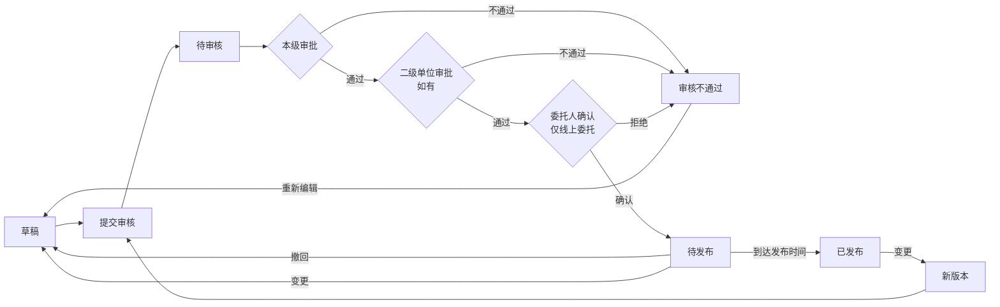

# 发布管理（公告）

> 关联文档：[项目执行总览](README.md)

## 1. 业务流程

### 1.1 公告发布与变更流程



**流程说明**：

| 操作 | 路径 | 说明 |
|------|------|------|
| 首次编制 | 草稿 → 提交审核 → 待审核 → 本级审批 → 二级单位审批 → 委托人确认（仅线上委托）→ 待发布 → 已发布 | 委托人即采购立项创建人 |
| 审批不通过 | 待审核 → 审核不通过 → 重新编辑 → 草稿 | 可编辑后重新提交 |
| 撤回 | 待发布 → 撤回 → 草稿 | 审核组件留下撤回记录，状态回退到草稿 |
| 变更（待发布） | 待发布 → 变更 → 草稿 → 重新提交审核 | 覆盖原内容，版本号+1 |
| 变更（已发布） | 已发布 → 变更 → 新版本 → 重新走主流程 | 审核通过后替换生效，原公告状态暂定（与业务确认中） |

**通用变更规则**：
- 变更时保留原版本快照到版本历史子表
- 主表更新为最新版本内容，版本号自增

### 1.2 级联时间默认值规则

以**公告开始时间**为基准锚点，标段公告信息中各时间字段按级联关系自动计算默认值：

```
公告开始时间（基准）
    │
    ├─→ 文件获取开始时间（默认 = 公告开始时间，只能选择之后的时间）
    │       │
    │       └─→ 文件获取截止时间（默认 = 公告开始时间 + N天）
    │               │
    │               └─→ 澄清截止时间（默认 = 公告开始时间 + M天，≥ 文件获取截止时间）
    │                       │
    │                       └─→ 截标/开标时间（默认 = 公告开始时间 + K天，≥ 澄清截止时间）
```

**各采购方式默认偏移量**：

| 时间字段 | 公开招标 | 询比/谈判（公开） | 竞价（公开） |
|---------|---------|----------------|------------|
| 文件获取开始时间 | +0天 | +0天 | 无此字段 |
| 文件获取截止时间 | +5天 | +3天 | 无此字段 |
| 澄清截止时间 | +6天 | +3天 | 无此字段 |
| 截标/开标时间 | +21天 | +5天 | 无此字段 |

**校验规则**：
- 文件获取开始时间 ≥ 公告开始时间
- 文件获取截止时间 ≥ 文件获取开始时间
- 澄清截止时间 ≥ 文件获取截止时间
- 截标/开标时间 ≥ 澄清截止时间
- 以上校验在提交审核时执行，校验失败滚动定位到对应字段

---

## 2. 数据结构 + 状态值

### 2.1 公告类型自动判定

| 采购方式 | 公告类型 | 供应商称呼 |
| ---- | ---- | ----- |
| 公开招标 | 招标公告 | 投标人 |
| 询比采购（公开） | 询比公告 | 供应商 |
| 谈判采购（公开） | 谈判公告 | 供应商 |
| 竞价（公开） | 竞价公告 | 供应商 |

### 2.2 公告类型差异概览

| 差异维度 | 公开招标 | 询比/谈判（公开） | 竞价（公开） |
|---------|---------|----------------|------------|
| 公告发布媒体 | 采购官网 + 中国招投标公共服务平台 | 仅采购官网 | 仅采购官网 |
| 文件获取截止默认 | 公告开始时间+5天 | +3天 | 无此字段 |
| 澄清截止默认 | +6天 | +3天 | 无此字段 |
| 截标/开标默认 | +21天 | +5天 | 无此字段 |
| 标段公告-竞价参数 | 无 | 无 | 竞价开始时间/类型/延时/时长/起拍价/价格梯度 |
| 其他说明-标书款支付 | ✅ 有 | ❌ 无 | ❌ 无 |
| 其他说明-平台使用费 | ❌ 无 | ✅ 有 | ✅ 有 |
| 其他说明-CA办理 | 必须办理 | 可不办理 | 可不办理 |
| 模板文本称呼 | 投标人/招标文件/招标活动 | 供应商/采购文件/采购活动 | 同询比 |

### 2.3 公告主表字段

公告页面分为 6 大区域：①项目信息 ②标段/包信息 ③公告信息 ④标段公告信息 ⑤采购单位信息 ⑥其他相关说明。

- **①②③⑤⑥** 为公告主表（项目级）字段
- **④** 为标段公告子表（标段包级），一个标段包对应一条记录

###### 区域①：项目信息（自动带入项目，只读为主）

| 字段   | 来源     | 可编辑 |
| ---- | ------ | --- |
| 项目名称/编号/类型/采购方式/行业分类 | 自动带入项目 | ❌ |
| 项目概况/其他 | 自动带入项目 | ✅ |

###### 区域②：标段/包信息（自动带入，列表，可增删）

展示当前公告关联的标段/包列表，支持添加（从项目标段包中选择）和删除。区域④的标段公告信息按所选标段/包逐个配置。

###### 区域③：公告信息

| 字段     | 类型    | 必填  | 说明 |
| ------ | ----- | --- | ---- |
| 公告名称   | 文本    | ✅   | 默认「项目名称+采购方式+公告」，可编辑 |
| 公告发布媒体 | 文本/多选 | ✅   | 默认勾选当前租户采购官网；**招标类**还需勾选中国招投标公共服务平台。可编辑增减 |
| 公告开始时间 | 日期时间  | ✅   | 默认选中 2 天后的 0 点。快捷选项：此刻、十分钟后、二十分钟后、半小时后。**不可选择当前时间及之前的时间** |
| 公告附件   | 文件上传  | ❌   | 支持多个，pdf/word/图片 |

###### 区域⑤：采购单位信息（默认填入，只读）

| 字段 | 说明 |
|------|------|
| 采购单位名称/地址/联系人/联系电话 | 默认填入，只读 |

###### 区域⑥：其他相关说明（系统内置模板，选填，可编辑覆盖）

| 字段     | 适用范围          | 说明 |
| ------ | ------------- | ---- |
| 发布媒介说明 | 全部            | 模板文本因采购方式而异 |
| 注册说明   | 全部            | 模板文本因采购方式而异（称呼/文件名称不同） |
| 标书款支付  | **仅公开招标**     | 非招标类无此字段 |
| 平台使用费  | **仅询比/谈判/竞价** | 招标类无此字段 |
| 文件下载   | 全部            | 模板文本因采购方式而异 |
| CA办理   | 全部            | 模板文本因采购方式而异（招标类必须办理，非招标可不办理） |
| 帮助信息   | 全部            | 模板文本各采购方式一致 |
| 其他信息   | 全部            | 模板文本因采购方式而异（招标类含异议条款） |

**招标类模板关键词**：投标人/招标文件/招标活动/标书款支付/异议条款/CA必须办理
**非招标类模板关键词**：供应商/采购文件/采购活动/平台使用费/无异议条款/CA可不办理

###### 主表系统字段

| 字段       | 类型  | 说明 |
| -------- | --- | ---- |
| 公告ID     | 主键  | 系统自动生成 |
| 当前版本号    | 数字  | 版本记录，初始为1，每次变更+1 |
| 公告状态     | 文本  | 见下方状态字典 |
| 创建人/创建时间 | 系统  | |
| 更新人/更新时间 | 系统  | |

### 2.4 标段公告信息子表

按标段/包独立配置，页面通过页签切换。一个标段包对应一条记录。

**时间字段（公开招标 / 询比 / 谈判适用）**：

| 字段 | 类型 | 必填 | 公开招标默认 | 询比/谈判默认 | 说明 |
|------|------|------|------------|-------------|------|
| 文件获取开始时间 | 日期时间 | ✅ | =公告开始时间 | =公告开始时间 | 只能选择公告开始时间之后 |
| 文件获取截止时间 | 日期时间 | ✅ | 公告开始时间+5天 | 公告开始时间+3天 | 可编辑 |
| 澄清截止时间 | 日期时间 | ✅ | 公告开始时间+6天 | 公告开始时间+3天 | 可编辑 |
| 截标/开标时间 | 日期时间 | ✅ | 公告开始时间+21天 | 公告开始时间+5天 | 可编辑 |
| 标书获取地点 | 文本 | ✅ | 当前租户采购官网，只读 | 当前租户采购官网，只读 | |
| 开标地点 | 文本 | ✅ | 当前租户采购官网名称，可编辑 | 当前租户采购官网名称，可编辑 | |

**竞价参数字段（仅竞价适用，带入标段包配置，只读）**：

| 字段 | 类型 | 必填 | 说明 |
|------|------|------|------|
| 竞价开始时间/类型/延时方式/竞价时长/延时时长/起拍价/价格梯度 | 日期/文本/数字 | ✅ | 带入标段信息，只读 |

**通用字段（全部采购方式）**：

| 字段              | 类型  | 必填  | 说明 |
| --------------- | --- | --- | ---- |
| 标段包ID/公告ID | 外键  | -   | 关联标段包/公告主表 |
| 采购范围/供应商基本要求/资质要求/业绩要求/其他要求 | 文本域 | ✅ | 带入标段包信息，可编辑 |
| 供应商拟投入项目负责人最低要求 | 长文本 | ❌ | 带入标段包信息，可编辑 |
| 备注 | 长文本 | ❌ | 选填 |

### 2.5 公告版本历史子表

| 字段 | 类型 | 说明 |
|------|------|------|
| 序号 | 自增主键 | 主键 |
| 公告ID | 外键 | 关联公告主表 |
| 版本号 | 数字 | 版本序号 |
| 公告名称/发布媒体/开始时间/附件/其他相关说明 | 快照 | 该版本快照 |
| 修改人/修改时间/修改原因 | 文本/日期时间 | 变更履历 |

**设计说明**：公告每次变更生成版本快照写入子表（含主表字段+标段公告子表数据），主表更新为最新版本内容。

### 2.6 状态字典

**公告主表状态**：

| 状态 | 状态码 | 说明 | 允许操作 |
|------|--------|------|---------|
| 草稿 | `DRAFT` | 编制中 | 编辑、提交审核、删除 |
| 待审核 | `PENDING_APPROVAL` | 已提交，审核中 | 查看、撤回（审核组件留记录） |
| 审核不通过 | `APPROVAL_REJECTED` | 审核拒绝 | 编辑、提交审核、删除 |
| 待发布 | `APPROVED` | 审批通过，未到发布时间 | 变更（回退至草稿）、查看 |
| 已发布 | `PUBLISHED` | 到达发布时间，对外可见 | 查看、变更（新版本重新送审） |

**状态流转**：

```
首次编制：
  草稿 → 提交审核 → 待审核 → 本级审批 → 二级单位审批（如有）→ 委托人确认（仅线上委托）
                      ↘ 审批不通过 → 审核不通过 → 编辑 → 草稿
                      ↘ 撤回 → 审核组件留记录 → 草稿
                                                    ↓
  确认通过 → 待发布 → 到达发布时间 → 已发布
              │
              └── 变更 → 草稿 → 重新提交审核

已发布后变更：
  已发布 → 变更 → 编辑 → 新版本重新送审 → 审核通过后替换生效
          （原公告状态暂定，与业务确认中）
```

**关键规则**：
- **待发布状态变更**：变更覆盖原内容，版本号+1，状态回退到草稿，需重新提交审核
- **已发布状态变更**：变更生成新版本，原版本保留在历史，新版本审批通过后替换生效
- **撤回**：待审核状态可撤回，审核组件留下撤回记录，状态回退到草稿

---

## 3. 页面设计

### 3.1 公告列表页

**功能路径**：`采购系统 → 项目管理 → 我的项目 → 进入项目 → 公告`

```
┌─ 公告管理 ───────────────────────────────────────────────────────┐
│  [ 新建公告 ]                                                      │
│  ┌─ 全部 ─┬─ 草稿 ─┬─ 待审核 ─┬─ 待发布 ─┬─ 已发布 ─┐           │
│  │ 公告标题 | 公告类型 | 状态 | 发布时间 | 版本 | 操作               │
│  │ ─────────────────────────────────────────────────────────────── │
│  │ XX工程招标公告 | 招标公告 | 已发布 | 06-15 | v3 | 查看/变更        │
│  │ YY设备询比公告 | 询比公告 | 待发布 | 06-20 | v1 | 变更/查看       │
│  │ ZZ服务谈判公告 | 谈判公告 | 草稿   | -    | v1 | 编辑/提交审核/删除 │
│  └────────────────────────────────────────────────────────────── │
└────────────────────────────────────────────────────────────────────┘
```

**操作按钮根据状态显示**：

| 状态 | 允许操作 |
|------|---------|
| 草稿 | 编辑、提交审核、删除 |
| 待审核 | 查看、撤回 |
| 审核不通过 | 编辑、提交审核、删除 |
| 待发布 | 变更、查看 |
| 已发布 | 查看、变更 |

**说明**：一个项目仅可有一个公告（非已发布状态）。

### 3.2 新建/编辑公告页

**页面结构（6 大区域平铺表单）**：

1. 项目信息（区域①，只读为主，自动带入）
2. 标段/包信息（区域②，列表，可增删）
3. 公告信息（区域③，项目级）
4. 标段公告信息（区域④，页签切换标段，按采购方式显示不同字段）
5. 采购单位信息（区域⑤，只读）
6. 其他相关说明（区域⑥，模板文本，可编辑覆盖）

```
┌─ 新建公告（公开招标示例）────────────────────────────────────────────┐
│  ▾ ① 项目信息（只读为主，自动带入项目）                                  │
│    项目名称/编号/类型/采购方式/行业分类（只读）                          │
│    项目概况/其他（自动带入，可编辑）                                     │
│                                                                        │
│  ▾ ② 标段/包信息（列表，可增删）                                        │
│    [ 添加标段包 ]                                                       │
│    ┌──────────────────────────────────────┐                             │
│    │ 标段/包名称 | 标段/包编号 | 操作       │                             │
│    └──────────────────────────────────────┘                             │
│                                                                        │
│  ▾ ③ 公告信息                                                          │
│  * 公告名称      [ 项目名称+采购方式+公告           ]                   │
│  * 公告发布媒体  ☑ 采购官网  ☑ 中国招投标公共服务平台                  │
│  * 公告开始时间  [ 2026-07-01 00:00 ]  快捷：[此刻][10分钟后][半小时后]│
│    公告附件      [ 上传文件 ]                                           │
│                                                                        │
│  ▾ ④ 标段公告信息（页签切换标段）                                       │
│    ┌─ 标段A ─┬─ 标段B ─┐                                               │
│    │ * 文件获取开始  [ 默认=公告开始时间 ]                              │
│    │ * 文件获取截止  [ 默认+5天，询比谈判+3天 ]                        │
│    │ * 澄清截止时间  [ 默认+6天，询比谈判+3天 ]                         │
│    │ * 截标/开标时间 [ 默认+21天，询比谈判+5天 ]                        │
│    │ * 标书获取地点  采购官网（只读）                                    │
│    │ * 开标地点     [ 采购官网名称 ]（可编辑）                          │
│    │ * 采购范围/供应商基本/资质/业绩/其他要求...                        │
│    │   项目负责人最低要求/备注（选填）                                   │
│                                                                        │
│  ▾ ⑤ 采购单位信息（只读）                                               │
│    采购单位名称/地址/联系人/联系电话                                     │
│                                                                        │
│  ▾ ⑥ 其他相关说明（模板文本，选填，可编辑覆盖）                          │
│    发布媒介说明/注册说明/标书款支付（仅招标）/平台使用费（仅非招标）/...  │
│                                                                        │
│  [ 保存草稿 ]  [ 提交审核 ]                                            │
└────────────────────────────────────────────────────────────────────────┘
```

**交互逻辑**：

| 操作 | 行为 |
|------|------|
| 进入新建页 | 自动带出①②⑤；③名称默认填充；④各标段时间默认填充；⑥模板按采购方式填充 |
| 修改公告开始时间 | ④中尚未手动修改过的时间字段同步更新默认值 |
| 添加/删除标段包 | ②列表增删，④页签同步增删对应标段Tab |
| 切换标段Tab | ④区域展示对应标段信息 |
| 点击保存草稿 | 校验公告名称、公告开始时间必填项，保存后状态为草稿 |
| 点击提交审核 | 校验全部必填项+级联时间规则，校验通过后进入待审核 |
| 校验失败 | 滚动定位到对应字段并提示错误 |

**按采购方式联动差异**：

| 采购方式 | ③发布媒体 | ④标段公告字段 | ⑥模板文本 |
|---------|----------|-------------|----------|
| 公开招标 | 采购官网 + 中国招投标公共服务平台 | 时间字段（+5/+6/+21天） + 通用字段 | 招标类模板 |
| 询比/谈判 | 仅采购官网 | 时间字段（+3/+3/+5天） + 通用字段 | 非招标类模板 |
| 竞价 | 仅采购官网 | 竞价参数字段（只读带入） + 通用字段 | 非招标类模板 |

### 3.3 公告详情页（查看模式）

**Tab 结构**：`公告信息 | 标段公告 | 版本历史 | 审批记录`

- **公告信息**：展示区域①②③⑤⑥全部字段
- **标段公告**：展示区域④各标段包的标段公告信息（页签切换标段）
- **版本历史**：展示版本历史子表记录，支持查看历史版本内容
- **审批记录**：接入审批流式记录组件

```
┌─ 公告详情 — [公告信息] [标段公告] [版本历史] [审批记录] ──────────┐
│  ▾ ①~⑥ 全部字段（只读展示）                                       │
│  ─────────────────────────────────────────────────────────────── │
│  草稿：        [ 编辑 ]  [ 提交审核 ]  [ 删除 ]                     │
│  待审核：      [ 撤回 ]  [ 关闭 ]                                   │
│  审核不通过：  [ 编辑 ]  [ 提交审核 ]  [ 删除 ]                     │
│  待发布：      [ 变更 ]  [ 关闭 ]                                   │
│  已发布：      [ 变更 ]  [ 关闭 ]                                   │
└────────────────────────────────────────────────────────────────────┘
```

### 3.4 变更操作

- 页面结构与新建公告一致，各字段回显当前内容
- 修改后保存：版本号+1，修改前内容写入版本历史子表，主表更新为最新内容
- 待发布状态变更后，状态回退到草稿，需重新提交审核
- 已发布状态变更后，新版本需重新审批，审批通过后替换生效
- 页面顶部提示："变更后将生成新版本（v{n+1}），原版本（v{n}）将保留在版本历史中。"

---

## 4. 审批流程

| 业务 | 审批路径 | 说明 |
|------|---------|------|
| 公告发布 | 本级审批 → 二级单位审批（如有）→ 委托人确认（仅线上委托） | 全部审核节点通过后进入待发布状态 |
| 公告变更 | 同公告发布 | 变更后的新版本需重新走完整审批流程 |

**审批说明**：
- 线上委托场景下，审批通过后还需委托人（即采购立项创建人）确认
- 待审核状态可撤回，审核组件留下撤回记录，状态变为草稿
- 审批通过后状态变为「待发布」
- 系统定时检查发布时间，到达发布时间后自动变为「已发布」
- 若发布时间已过（早于当前时间），审批通过后立即发布

---

## 5. 待确认问题

| #   | 问题                                                                | 状态  |
| --- | ----------------------------------------------------------------- | --- |
| 1   | 级联时间默认值按自然日还是工作日计算？                                               | 待确认 |
| 2   | 公告的维度是项目级还是标段级？当前设计为项目级（多标段合并在一个公告），但编辑公告时若删除某标段，被删除的标段又可以单独新建公告？ | 待确认 |
| 3   | 采购公告和采购文件在招标人确认环节，具体由哪个角色/用户来确认？                                  | 待确认 |
| 4   | 公告开始时间和文件获取开始时间是否必须一致？当前系统未做此项校验，是否需要补充？                          | 待确认 |
| 5   | 公告变更已发布后，原公告是暂停显示还是直接替换？新版本生效期间已报名的供应商如何处理？                    | 待确认（暂定暂停） |
| 6   | 公告变更是否需要走本级审核和招标人确认流程？如果变更了文件获取截止时间，但审核流程未能在截止时间前完成，如何处理？        | 待确认 |
| 7   | 测试环境存在 Bug：公告开始时间未到，但状态已显示为"已发布"。需确认期望行为是到达发布时间才变为已发布。            | 需修复 |
| 8   | 踏勘现场安排在哪个环节？是否需要纳入招标公告的内容中展示？                                    | 待确认 |
| 9   | 线上委托场景下，委托人拒绝后如何处理？公告是否需要允许重新编辑提交？                                 | 待确认 |
