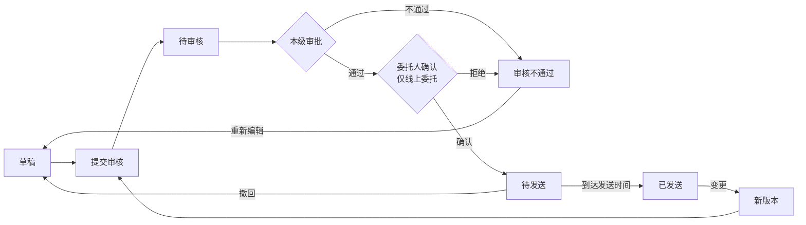

# 发布管理（邀请函）

> 关联文档：[项目执行总览](README.md)

## 1. 业务流程

### 1.1 邀请函发送与变更流程



**直接采购特殊前置**：
- 直接采购项目发送邀请函前，须先完成「事前公示」环节
- 新建邀请函时校验事前公示已完成，未完成则阻止新建并提示

**通用变更规则**：
- 已发送状态变更时保留原版本快照到版本历史子表
- 主表更新为最新版本内容，版本号自增

---

## 2. 数据结构 + 状态值

### 2.1 邀请函对应采购方式

邀请函面向特定供应商发送，不同于公告对全互联网可见。对应采购方式如下：

| 采购方式 | 是否公开 | 供应商称呼 |
| ---- | ---- | ----- |
| 邀请招标 | -    | 投标人   |
| 询比采购 | 否    | 供应商   |
| 谈判采购 | 否    | 供应商   |
| 竞价   | 否    | 供应商   |
| 直接采购 | 否    | 供应商   |

### 2.2 邀请函数据结构

不同于公告可关联 1~N 个标段，邀请函与标段为 **1:1** 关系：一条邀请函只关联当前标段，默认带入且不可取消。一个项目有多个标段时，各标段各自独立发送自己的邀请函。

邀请函数据由四部分组成：
- **邀请函主表**：每条邀请函一条记录，包含关联项目、邀请函信息、关联标段（当前标段，只读）、邀请供应商列表、采购单位信息、其他相关说明
- **标段邀请配置表**（标段包级）：与邀请函 1:1，一条记录，包含时间/竞价参数和供应商要求
- **供应商回复状态子表**：跟踪各受邀供应商的回复情况
- **邀请函版本历史子表**：记录每次变更的完整快照

```
邀请函主表（1条记录）
├── 关联项目（只读带入）
├── 邀请函信息（名称/发送时间/附件）
├── 关联标段列表 ↗┐
├── 邀请供应商列表 ↗│（默认带入立项邀请供应商，可增删）  每条邀请函可关联 1~N 个标段
├── 采购单位信息 ↗│（只读带入）                        未关联的标段后续可另行发邀请函
└── 其他相关说明 ↗│
                  │
标段邀请配置表（N条记录，按标段独立配置）
├── 时间字段（招标/询比/谈判/直接采购）或 竞价参数（竞价）
└── 供应商要求（采购范围/基本/资质/业绩/其他要求）

供应商回复状态子表（N条记录，按供应商跟踪）
├── 供应商信息（名称/ID）
└── 回复信息（是否同意邀请/原因/回复时间）

邀请函版本历史子表（每次变更一条记录）
└── 完整快照（主表 + 标段配置 + 邀请供应商列表）
```

### 2.3 字段定义

#### 邀请函主表字段（邀请函级）

**关联项目**（自动带入，只读为主）：

| 字段   | 类型  | 必填  | 来源     | 可编辑 | 说明       |
| ---- | --- | --- | ------ | --- | -------- |
| 项目名称 | 文本  | -   | 自动带入项目 | ❌   |          |
| 项目编号 | 文本  | -   | 自动带入项目 | ❌   |          |
| 项目类型 | 文本  | -   | 自动带入项目 | ❌   | 工程/物资/服务 |
| 采购方式 | 文本  | -   | 自动带入项目 | ❌   |          |
| 行业分类 | 文本  | -   | 自动带入项目 | ❌   | 本项目行业分类  |
| 项目概况 | 文本域 | ❌   | 自动带入项目 | ✅   | 可编辑      |
| 其他   | 文本域 | ❌   | 自动带入项目 | ✅   | 可编辑      |

**邀请函信息**：

| 字段       | 类型    | 必填  | 来源         | 可编辑 | 说明                            |
| -------- | ----- | --- | ---------- | --- | ----------------------------- |
| 邀请函名称    | 文本    | ✅   | 自动填充       | ✅   | 默认「项目名称+采购方式+邀请函」             |
| 邀请函发送时间  | 日期时间  | ✅   | 自动计算       | ✅   | 默认2天后0点，快捷选项：此刻/10分钟/20分钟/半小时 |
| 邀请函附件    | 文件上传  | ❌   | 手动上传       | ✅   | 支持多个pdf/word/图片               |

**关联标段列表**：

| 字段   | 类型   | 必填  | 来源    | 可编辑 | 说明                           |
| ---- | ---- | --- | ----- | --- | ---------------------------- |
| 关联标段 | 标段多选 | ✅   | 项目标段包 | ✅   | 默认全选未关联标段，支持增删，一条邀请函可关联1~N个标段 |

**邀请供应商列表**（核心差异模块，替代公告的"发布媒体"）：

| 字段     | 类型    | 必填  | 来源              | 可编辑 | 说明                                  |
| ------ | ----- | --- | --------------- | --- | ----------------------------------- |
| 供应商名称  | 弹窗多选  | ✅   | 默认带入立项邀请供应商     | ✅   | 可继续添加/删除；直接采购为单一指定供应商，只读不可增删        |
| 企业代码   | 文本    | -   | 自动带入             | ❌   |                                     |
| 联系人    | 文本    | -   | 自动带入             | ❌   |                                     |
| 联系电话   | 文本    | -   | 自动带入             | ❌   |                                     |
| 是否同意邀请 | 文本    | -   | 供应商回复            | ❌   | 待回复/同意/不同意，已发送后在详情页直接展示             |
| 原因     | 长文本   | ❌   | 供应商回复            | ❌   | 供应商填写的原因                            |

**采购单位信息**：

| 字段     | 类型 | 必填 | 来源     | 可编辑 | 说明 |
| -------- | ---- | ---- | -------- | ------ | ---- |
| 采购单位名称 | 文本 | -    | 自动带入 | ❌     |      |
| 采购单位地址 | 文本 | -    | 自动带入 | ❌     |      |
| 联系人     | 文本 | -    | 自动带入 | ❌     |      |
| 联系电话     | 文本 | -    | 自动带入 | ❌     |      |

**其他相关说明**：

| 字段     | 类型  | 必填  | 来源   | 可编辑 | 说明                |
| ------ | --- | --- | ---- | --- | ----------------- |
| 注册说明   | 长文本 | ❌   | 系统模板 | ✅   | 模板文本因采购方式而异       |
| 标书款支付  | 长文本 | ❌   | 系统模板 | ✅   | 仅邀请招标，非招标类无此字段    |
| 平台使用费  | 长文本 | ❌   | 系统模板 | ✅   | 仅询比/谈判/竞价/直接采购，招标类无此字段 |
| 文件下载   | 长文本 | ❌   | 系统模板 | ✅   | 模板文本因采购方式而异       |
| CA办理   | 长文本 | ❌   | 系统模板 | ✅   | 招标类必须办理，非招标可不办理   |
| 帮助信息   | 长文本 | ❌   | 系统模板 | ✅   | 模板各采购方式一致         |
| 其他信息   | 长文本 | ❌   | 系统模板 | ✅   | 招标类含异议条款，非招标不含    |

**系统字段**：

| 字段       | 类型  | 说明               |
| -------- | --- | ---------------- |
| 邀请函ID    | 主键  | 系统自动生成           |
| 当前版本号    | 数字  | 版本记录，初始为1，每次变更+1 |
| 邀请函状态    | 文本  | 见下方状态字典          |
| 创建人/创建时间 | 系统  |                  |
| 更新人/更新时间 | 系统  |                  |

#### 标段邀请配置表（标段包级）

按标段/包独立配置，页面通过页签切换。一个标段包对应一条记录。

**关联字段**：

| 字段     | 类型 | 必填 | 来源     | 说明 |
| -------- | ---- | ---- | -------- | ---- |
| 邀请函ID   | 外键 | 是   | 邀请函主表 | 关联所属邀请函 |
| 标段包ID | 外键 | 是   | 项目标段包 | 关联所属标段 |

**时间字段（邀请招标 / 询比 / 谈判 / 直接采购适用，竞价不适用）**：

| 字段       | 类型   | 必填  | 来源               | 可编辑 | 说明                  |
| -------- | ---- | --- | ---------------- | --- | ------------------- |
| 文件获取开始时间 | 日期时间 | ✅   | 自动计算（=邀请函发送时间）   | ✅   | 只能选择邀请函发送时间之后        |
| 文件获取截止时间 | 日期时间 | ✅   | 自动计算             | ✅   | 邀请招标默认+5天，询比/谈判/直接采购默认+3天  |
| 澄清截止时间   | 日期时间 | ✅   | 自动计算             | ✅   | 邀请招标默认+6天，询比/谈判/直接采购默认+3天  |
| 截标/开标时间  | 日期时间 | ✅   | 自动计算             | ✅   | 邀请招标默认+21天，询比/谈判/直接采购默认+5天 |
| 标书获取地点   | 文本   | ✅   | 自动带入（当前租户采购官网）   | ❌   |                     |
| 开标地点     | 文本   | ✅   | 自动带入（当前租户采购官网名称） | ✅   |                     |

**竞价参数字段（仅竞价适用，带入标段包配置，只读）**：

| 字段       | 类型   | 必填  | 来源    | 可编辑 | 说明  |
| -------- | ---- | --- | ----- | --- | --- |
| 竞价开始时间   | 日期时间 | ✅   | 带入标段包 | ✅   |     |
| 竞价类型     | 文本   | ✅   | 带入标段包 | ❌   |     |
| 延时方式     | 文本   | ✅   | 带入标段包 | ❌   |     |
| 竞价时长（分钟） | 数字   | ✅   | 带入标段包 | ❌   |     |
| 延时时长（分钟） | 数字   | ✅   | 带入标段包 | ❌   |     |
| 起拍价（元）   | 数字   | ✅   | 带入标段包 | ❌   |     |
| 价格梯度（元）  | 数字   | ✅   | 带入标段包 | ❌   |     |

**供应商要求（全部采购方式）**：

| 字段              | 类型  | 必填  | 来源    | 可编辑 | 说明  |
| --------------- | --- | --- | ----- | --- | --- |
| 采购范围            | 文本域 | ✅   | 带入标段包 | ✅   |     |
| 供应商基本要求         | 文本域 | ✅   | 带入标段包 | ✅   |     |
| 供应商资质要求         | 文本域 | ✅   | 带入标段包 | ✅   |     |
| 供应商业绩要求         | 文本域 | ✅   | 带入标段包 | ✅   |     |
| 供应商其他要求         | 文本域 | ✅   | 带入标段包 | ✅   |     |
| 供应商拟投入项目负责人最低要求 | 长文本 | ❌   | 带入标段包 | ✅   |     |
| 备注              | 长文本 | ❌   | -     | ✅   | 选填  |

**级联时间默认值规则**：

以**邀请函发送时间**为基准锚点，上述时间字段按级联关系自动计算默认值：

```
邀请函发送时间（基准，来自邀请函主表）
    │
    ├─→ 文件获取开始时间（默认 = 邀请函发送时间，只能选择之后的时间）
    │       │
    │       └─→ 文件获取截止时间（默认 = 邀请函发送时间 + N天）
    │               │
    │               └─→ 澄清截止时间（默认 = 邀请函发送时间 + M天，≥ 文件获取截止时间）
    │                       │
    │                       └─→ 截标/开标时间（默认 = 邀请函发送时间 + K天，≥ 澄清截止时间）
```

**各采购方式默认偏移量**：

| 时间字段 | 邀请招标 | 询比/谈判/直接采购 |
|---------|---------|----------|
| 文件获取开始时间 | +0天 | +0天 |
| 文件获取截止时间 | +5天 | +3天 |
| 澄清截止时间 | +6天 | +3天 |
| 截标/开标时间 | +21天 | +5天 |

**校验规则**：
- 文件获取开始时间 ≥ 邀请函发送时间
- 文件获取截止时间 ≥ 文件获取开始时间
- 澄清截止时间 ≥ 文件获取截止时间
- 截标/开标时间 ≥ 澄清截止时间
- 以上校验在提交审核时执行，校验失败滚动定位到对应字段

### 2.4 供应商回复状态子表

| 字段                            | 类型   | 必填  | 说明                                                 |
| ----------------------------- | ---- | --- | -------------------------------------------------- |
| 序号（reply_id）                  | 自增主键 | ✅   | 回复记录唯一标识                                           |
| 邀请函ID（invitation_id）          | 外键   | ✅   | 关联邀请函主表                                            |
| 供应商ID（supplier_id）            | 外键   | ✅   | 受邀供应商                                              |
| 供应商名称（supplier_name）          | 文本   | ✅   |                                                    |
| 是否同意邀请（reply_status）         | 文本   | ✅   | `PENDING`待回复 / `ACCEPTED`同意 / `REJECTED`不同意        |
| 原因（reason）                    | 长文本  | ❌   | 供应商填写的原因                                           |
| 回复时间（reply_at）               | 日期时间 | ❌   | 供应商回复时间                                            |

### 2.5 邀请函版本历史子表

| 字段                            | 类型   | 必填  | 说明                                                 |
| ----------------------------- | ---- | --- | -------------------------------------------------- |
| 序号（version_history_id）        | 自增主键 | ✅   | 版本记录唯一标识                                           |
| 邀请函ID（invitation_id）          | 外键   | ✅   | 关联邀请函主表                                            |
| 版本号（version_number）           | 数字   | ✅   | 版本序号，初始为1，每次变更+1                                   |
| 变更原因（change_reason）          | 长文本  | ❌   | 变更原因说明                                             |
| 邀请函主表快照（invitation_snapshot） | JSON | ✅   | 完整快照：项目信息、邀请函信息、邀请供应商列表、采购单位信息、其他相关说明              |
| 标段配置快照（sections_snapshot）     | JSON | ✅   | 完整快照：关联标段列表及各标段的时间字段/竞价参数/供应商要求                    |
| 修改人（modified_by）              | 用户ID | ✅   | 发起变更的用户                                            |
| 修改时间（modified_at）             | 日期时间 | ✅   | 变更提交时间                                             |


### 2.6 状态字典

**邀请函主表状态**：

| 状态    | 状态码                 | 说明          | 允许操作           |
| ----- | ------------------- | ----------- | -------------- |
| 草稿    | `DRAFT`             | 编制中         | 编辑、提交审核、删除     |
| 待审核   | `PENDING_APPROVAL`  | 已提交，审核中     | 查看、撤回（审核组件留记录） |
| 审核不通过 | `APPROVAL_REJECTED` | 审核拒绝        | 编辑、提交审核、删除     |
| 待发送   | `APPROVED`          | 审批通过，未到发送时间 | 撤回、查看         |
| 已发送   | `SENT`              | 到达发送时间，已通知供应商 | 查看、变更（新版本重新送审） |

**说明**：供应商回复状态在邀请函详情页直接展示，不单设"查看回复"操作按钮。


---

## 3. 页面设计

### 3.1 邀请函信息展示区

**功能路径**：
- `采购系统 → 项目管理 → 我的项目 → 进入项目`
- `采购系统 → 项目管理 → 我的工作台 → 进入项目`

**页面结构**：

页面顶部为采购流程步骤页签，切换至"发送邀请函"页签后，下方展示邀请函信息卡片。

```
┌─ 项目详情页 ─────────────────────────────────────────────────────────────────┐
│  XX项目（标段A）                                                            │
│                                                                             │
│  [发送邀请函]  [采购文件]  [标前准备]  [开启]  [评审]  [成交]  [成交后]      │
│  ─────────────────────────────────────────────────────────────────────      │
│                                                                             │
│  ┌─────────────────────────────────────────────────────────────────────┐   │
│  │ 邀请函名称   │ XX项目邀请招标邀请函                                 │   │
│  │ 项目类型     │ 工程                                                  │   │
│  │ 邀请函状态   │ 已发送                                                │   │
│  │ 行业分类     │ 工业                                                  │   │
│  │ 采购方式     │ 邀请招标                                              │   │
│  │ 变更次数     │ 2次                                                  │   │
│  │ 邀请函发送时间 │ 2026-06-15 00:00                                    │   │
│  └─────────────────────────────────────────────────────────────────────┘   │
│                                                                             │
│  ┌─────────────────────────────────────────────────────────────────────┐   │
│  │                     [编辑]  [提交审核]  [查看历史邀请函]             │   │
│  └─────────────────────────────────────────────────────────────────────┘   │
│                                                                             │
└─────────────────────────────────────────────────────────────────────────────┘
```

**字段说明**：邀请函名称、项目类型、邀请函状态、行业分类、采购方式、变更次数、邀请函发送时间。

**操作按钮（与邀请函状态联动）**：

| 邀请函状态 | 操作按钮 |
|---------|---------|
| 草稿 | [编辑] [提交审核] [查看历史邀请函] |
| 待审核 | [撤回] [查看历史邀请函] |
| 审核不通过 | [编辑] [提交审核] [查看历史邀请函] |
| 待发送 | [撤回] [查看历史邀请函] |
| 已发送 | [变更] [查看历史邀请函] |

### 3.2 新建/编辑邀请函页

**触发方式**：项目详情页发送邀请函卡片点击 [新建] 或 [编辑]

**页面模块顺序**：项目信息 → 邀请函信息 → 关联标段 → 标段/包信息 → 邀请供应商 → 采购单位信息 → 其他相关说明

```
┌─ 新建邀请函（邀请招标示例）────────────────────────────────────────────────┐
│  [返回]                                                                   │
│                                                                            │
│  ▾ ① 项目信息                                                              │
│  ┌─────────────────────────────────────────────────────────────────────┐  │
│  │ 项目名称    │ XX项目                                    （只读）       │  │
│  │ 项目编号    │ XXXX                                      （只读）       │  │
│  │ 项目类型    │ 工程                                      （只读）       │  │
│  │ 采购方式    │ 邀请招标                                    （只读）       │  │
│  │ 行业分类    │ 工业                                      （只读）       │  │
│  │ 项目概况    │ ┌───────────────────────────────────────────┐（可编辑）   │  │
│  │             │                                           │          │  │
│  │             └───────────────────────────────────────────┘          │  │
│  │ 其他        │ ┌───────────────────────────────────────────┐（可编辑）   │  │
│  │             │                                           │          │  │
│  │             └───────────────────────────────────────────┘          │  │
│  └─────────────────────────────────────────────────────────────────────┘  │
│                                                                            │
│  ▾ ② 邀请函信息                                                            │
│  ┌─────────────────────────────────────────────────────────────────────┐  │
│  │ * 邀请函名称    │ XX项目邀请招标邀请函                                │  │
│  │ * 邀请函发送时间 │ [ 2026-06-17 00:00 ]                              │  │
│  │                 │ 快捷：[此刻] [10分钟] [20分钟] [半小时]            │  │
│  │   邀请函附件    │ [ 上传文件 ]  支持pdf/word/图片                    │  │
│  └─────────────────────────────────────────────────────────────────────┘  │
│                                                                            │
│  ▾ ③ 关联标段                                                              │
│  ┌─────────────────────────────────────────────────────────────────────┐  │
│  │ [ 标段A ✓ ] [ 标段B ✓ ] [ 标段C  ] [ + 添加 ]                      │  │
│  │ 默认全选未关联标段，支持增删，一条邀请函可关联1~N个标段                 │  │
│  └─────────────────────────────────────────────────────────────────────┘  │
│                                                                            │
│  ▾ ④ 标段/包信息                                                          │
│  ┌─ 标段A ────── 标段B ──────────────────────────────────────────────┐  │
│  │                                                                      │  │
│  │  时间字段                                                            │  │
│  │  * 文件获取开始时间  │ [ 2026-06-17 00:00 ]  （默认=邀请函发送时间）   │  │
│  │  * 文件获取截止时间  │ [ 2026-06-22 00:00 ]  （默认+5天）           │  │
│  │  * 澄清截止时间      │ [ 2026-06-23 00:00 ]  （默认+6天）           │  │
│  │  * 截标/开标时间     │ [ 2026-07-08 00:00 ]  （默认+21天）          │  │
│  │  * 标书获取地点      │ XX采购官网                          （只读）     │  │
│  │  * 开标地点          │ ┌───────────────────┐            （可编辑）      │  │
│  │                      │                   │                         │  │
│  │                      └───────────────────┘                         │  │
│  │                                                                      │  │
│  │  供应商要求                                                          │  │
│  │  * 采购范围          │ ┌───────────────────────────────────────┐      │  │
│  │                        │                                       │      │  │
│  │                        └───────────────────────────────────────┘    │  │
│  │  * 供应商基本要求    │ ┌───────────────────────────────────────┐      │  │
│  │                        │                                       │      │  │
│  │                        └───────────────────────────────────────┘    │  │
│  │  * 供应商资质要求    │ ┌───────────────────────────────────────┐      │  │
│  │                        │                                       │      │  │
│  │                        └───────────────────────────────────────┘    │  │
│  │  * 供应商业绩要求    │ ┌───────────────────────────────────────┐      │  │
│  │                        │                                       │      │  │
│  │                        └───────────────────────────────────────┘    │  │
│  │  * 供应商其他要求    │ ┌───────────────────────────────────────┐      │  │
│  │                        │                                       │      │  │
│  │                        └───────────────────────────────────────┘    │  │
│  │    项目负责人最低要求 │ ┌───────────────────────────────────────┐      │  │
│  │                        │                                       │      │  │
│  │                        └───────────────────────────────────────┘    │  │
│  │    备注              │ ┌───────────────────────────────────────┐      │  │
│  │                        │                                       │      │  │
│  │                        └───────────────────────────────────────┘    │  │
│  └─────────────────────────────────────────────────────────────────────┘  │
│                                                                            │
│  ▾ ⑤ 邀请供应商                                                            │
│  ┌─────────────────────────────────────────────────────────────────────┐  │
│  │ [ 选择供应商 ]   默认带入立项邀请供应商，可继续添加/删除              │  │
│  │ ┌─────────────────────────────────────────────────────────────────┐ │  │
│  │ │ 供应商名称 │ 企业代码    │ 联系人 │ 联系电话   │ 是否同意邀请 │ 原因 │ │  │
│  │ │───────────┼────────────┼───────┼───────────┼──────────────┼─────│ │  │
│  │ │ XX公司    │ 911100...  │ 张三  │ 138xxxx   │ 待回复        │ -   │ │  │
│  │ │ YY公司    │ 912200...  │ 李四  │ 139xxxx   │ 待回复        │ -   │ │  │
│  │ │                                                                │ │  │
│  │ │ （是否同意邀请/原因列在已发送后展示回复内容，编制阶段显示"待回复"）│ │  │
│  │ └─────────────────────────────────────────────────────────────────┘ │  │
│  └─────────────────────────────────────────────────────────────────────┘  │
│                                                                            │
│  ▾ ⑥ 采购单位信息                                                          │
│  ┌─────────────────────────────────────────────────────────────────────┐  │
│  │ 采购单位名称 │ XXX公司                                    （只读）       │  │
│  │ 采购单位地址 │ XXX市XXX区XXX路                          （只读）       │  │
│  │ 联系人       │ 李四                                      （只读）       │  │
│  │ 联系电话     │ 138XXXXXXXX                              （只读）       │  │
│  └─────────────────────────────────────────────────────────────────────┘  │
│                                                                            │
│  ▾ ⑦ 其他相关说明                                                          │
│  ┌─────────────────────────────────────────────────────────────────────┐  │
│  │ 注册说明      │ ┌───────────────────────────────────────────┐          │  │
│  │               │                                            │          │  │
│  │               └───────────────────────────────────────────┘          │  │
│  │ 标书款支付    │ ┌───────────────────────────────────────────┐          │  │
│  │               │                                            │          │  │
│  │               └───────────────────────────────────────────┘          │  │
│  │ 文件下载      │ ┌───────────────────────────────────────────┐          │  │
│  │               │                                            │          │  │
│  │               └───────────────────────────────────────────┘          │  │
│  │ CA办理        │ ┌───────────────────────────────────────────┐          │  │
│  │               │                                            │          │  │
│  │               └───────────────────────────────────────────┘          │  │
│  │ 帮助信息      │ ┌───────────────────────────────────────────┐          │  │
│  │               │                                            │          │  │
│  │               └───────────────────────────────────────────┘          │  │
│  │ 其他信息      │ ┌───────────────────────────────────────────┐          │  │
│  │               │                                            │          │  │
│  │               └───────────────────────────────────────────┘          │  │
│  └─────────────────────────────────────────────────────────────────────┘  │
│                                                                            │
│  [ 保存草稿 ]  [ 提交审核 ]                                                │
│                                                                            │
└────────────────────────────────────────────────────────────────────────────┘
```

**邀请供应商（直接采购示例）**：

```
┌─ 邀请供应商（直接采购）──────────────────────────────────────────────┐
│                                                                        │
│  直接采购面向单一指定供应商，从立项带入，只读不可增删                       │
│  ┌─────────────────────────────────────────────────────────────────┐ │
│  │ 供应商名称 │ 企业代码    │ 联系人 │ 联系电话   │ 是否同意邀请 │ 原因 │ │
│  │───────────┼────────────┼───────┼───────────┼──────────────┼─────│ │
│  │ XX公司    │ 911100...  │ 张三  │ 138xxxx   │ 待回复        │ -   │ │
│  └─────────────────────────────────────────────────────────────────┘ │
│                                                                        │
│  提示：直接采购项目需先完成「事前公示」后方可发送邀请函                   │
└────────────────────────────────────────────────────────────────────────┘
```

**标段/包信息（竞价示例）**：

```
┌─ 标段C（竞价方式）──────────────────────────────────────────────────┐
│                                                                      │
│  竞价参数（带入标段包配置）                                           │
│  * 竞价开始时间   │ [ 2026-06-17 00:00 ]                            │
│    竞价类型       │ 网上竞价                            （只读）        │
│    延时方式       │ 自动延时                            （只读）        │
│    竞价时长       │ 30分钟                              （只读）        │
│    延时时长       │ 5分钟                               （只读）        │
│    起拍价         │ 100,000.00元                        （只读）        │
│    价格梯度       │ 500元                               （只读）        │
│                                                                      │
│  供应商要求                                                          │
│  * 采购范围          │ ┌───────────────────────────────────────┐      │
│                        │                                       │      │
│                        └───────────────────────────────────────┘    │
│  * 供应商基本要求    │ ┌───────────────────────────────────────┐      │
│                        │                                       │      │
│                        └───────────────────────────────────────┘    │
│  ...（其余供应商要求字段同上）                                          │
└──────────────────────────────────────────────────────────────────────┘
```

**交互逻辑**：

| 操作       | 行为                                                         |
| -------- | ---------------------------------------------------------- |
| 进入新建页    | 自动带出项目信息/采购单位信息；默认关联全部未关联标段；邀请函名称默认填充；各标段时间默认填充；邀请供应商默认带入立项已选供应商；模板文本按采购方式填充 |
| 直接采购进入新建 | 校验事前公示已完成，未完成阻止新建并提示                                       |
| 修改关联标段列表 | 添加/删除标段，④标段/包信息页签同步增删对应标段Tab                               |
| 修改邀请函发送时间 | ④中时间字段同步更新默认值                                              |
| 切换标段Tab  | 标段/包信息页签展示对应标段的配置信息                                        |
| 选择供应商    | 弹窗从供应商库选择（多选），支持按供应商名称/企业代码搜索；直接采购只读不可选择                  |
| 点击保存草稿   | 校验邀请函名称、邀请函发送时间、已选标段、已选供应商必填项，保存后状态为草稿                    |
| 点击提交审核   | 校验全部必填项+级联时间规则，校验通过后进入待审核                                  |
| 校验失败     | 滚动定位到对应字段并提示错误                                             |

**按采购方式联动差异**：

| 采购方式 | 标段/包信息字段 | 邀请供应商 | 模板文本 |
|---------|-------------|----------|----------|
| 邀请招标 | 时间字段（+5/+6/+21天） + 通用字段 | 多选（带入立项供应商可增删） | 招标类模板 |
| 询比/谈判 | 时间字段（+3/+3/+5天） + 通用字段 | 多选（带入立项供应商可增删） | 非招标类模板 |
| 竞价 | 竞价参数字段（只读带入） + 通用字段 | 多选（带入立项供应商可增删） | 非招标类模板 |
| 直接采购 | 时间字段（+3/+3/+5天） + 通用字段 | 单一指定供应商（只读） | 非招标类模板 |

### 3.3 供应商回复查看（详情页内）

**触发方式**：邀请函已发送后，在邀请函详情页内展示供应商回复情况

**展示内容**：

```
┌─ 邀请供应商回复情况 ──────────────────────────────────────────────┐
│                                                                    │
│  供应商名称 │ 企业代码    │ 联系人 │ 联系电话   │ 是否同意邀请 │ 原因      │
│ ──────────────────────────────────────────────────────────────────│
│  XX公司   │ 911100...  │ 张三  │ 138xxxx   │ 同意          │ -        │
│  YY公司   │ 912200...  │ 李四  │ 139xxxx   │ 不同意        │ 已有项目安排│
│  ZZ公司   │ 913300...  │ 王五  │ 137xxxx   │ 待回复        │ -        │
│                                                                    │
│  汇总：共3家  同意1家  不同意1家  待回复1家                              │
└────────────────────────────────────────────────────────────────────┘
```

**字段说明**：

| 字段 | 说明 | 数据来源 |
|------|------|---------|
| 供应商名称 | 受邀供应商 | 邀请供应商列表 |
| 企业代码 | 供应商统一社会信用代码 | 邀请供应商列表 |
| 联系人/联系电话 | 供应商联系人 | 邀请供应商列表 |
| 是否同意邀请 | 待回复/同意/不同意 | 供应商回复状态子表 |
| 原因 | 供应商填写的原因 | 供应商回复状态子表 |

**说明**：回复情况随邀请函详情页直接展示，无需独立操作按钮；汇总行展示各回复状态数量。

### 3.4 查看历史邀请函（弹窗）

**触发方式**：项目详情页发送邀请函卡片点击 [查看历史邀请函] 按钮

**弹窗内容**：

```
┌─ 历史邀请函 ───────────────────────────────────────────┐
│                                                       │
│  序号    邀请函名称              变更时间        操作     │
│ ───────────────────────────────────────────────────── │
│  1      XX项目邀请招标邀请函(v2)   2026-06-20     [查看]    │
│  2      XX项目邀请招标邀请函(v1)   2026-06-15     [查看]    │
│                                                       │
│                                              [关闭]    │
└───────────────────────────────────────────────────────┘
```

**字段说明**：

| 字段 | 说明 | 数据来源 |
|------|------|---------|
| 序号 | 版本历史记录序号 | 版本历史子表 version_history_id |
| 邀请函名称 | 该版本的邀请函名称（带版本号）| 版本历史子表 invitation_snapshot.邀请函名称 |
| 变更时间 | 变更创建时间 | 版本历史子表 modified_at |
| 操作 | [查看] 按钮 | 点击查看该版本快照详情 |

**快照详情弹窗**：
- 点击 [查看] 后打开新弹窗/抽屉，展示该版本的完整快照内容
- 展示字段与邀请函详情页一致（只读模式），包含项目信息、邀请函信息、采购单位信息、其他相关说明、标段邀请配置、邀请供应商列表
- 底部显示变更原因（如有）

### 3.5 变更操作

**触发方式**：项目详情页发送邀请函卡片（已发送状态）点击 [变更]

**页面结构**：与新建/编辑邀请函页一致的7个模块（项目信息 → 邀请函信息 → 关联标段 → 标段/包信息 → 邀请供应商 → 采购单位信息 → 其他相关说明 + 变更内容），差异如下：

**模块差异**：
- ② **邀请函信息**：邀请函发送时间 → 只读，其他字段可编辑（同新增）
- ③ **关联标段**：只读展示，禁止增删
- ⑤ **邀请供应商**：可增删（同新增）
- ⑦ **其他相关说明**：最后追加"变更内容"模块
- 按钮置于页面顶部

```
┌─ 变更邀请函 — XX项目邀请招标邀请函（第2次变更）
│  [取消变更]  [保存]  [提交审核]                                    ──── 顶部按钮
│
│  ▾ ① 项目信息（同新增，略）
│  ▾ ② 邀请函信息                                                         │
│  ┌─────────────────────────────────────────────────────────────────┐ │
│  │ * 邀请函名称    │ XX项目邀请招标邀请函                           │ │
│  │   邀请函发送时间 │ 2026-06-15 00:00                    （只读）      │ │
│  │   邀请函附件    │ 已上传.pdf                           （可编辑）    │ │
│  └─────────────────────────────────────────────────────────────────┘ │
│  ▾ ③ 关联标段（只读展示）                                              │
│  ┌─────────────────────────────────────────────────────────────────┐ │
│  │ [ 标段A ✓ ] [ 标段B ✓ ]                                        │ │
│  └─────────────────────────────────────────────────────────────────┘ │
│  ▾ ④ 标段/包信息（同新增，略）                                         │
│  ▾ ⑤ 邀请供应商（同新增，可增删）                                       │
│  ▾ ⑥ 采购单位信息（同新增，略）                                         │
│  ▾ ⑦ 其他相关说明  （同新增，略）                                                
│  ▾ 变更内容                                                             │
│  ┌─────────────────────────────────────────────────────────────────┐ │
│  │ XX项目邀请招标邀请函（第2次变更）                               │ │
│  │ ────────────────────────────────────────────────                │ │
│  │ 标段：标段A                                                      │ │
│  │  字段：截标/开标时间                                              │ │
│  │  原内容：2026-07-08 00:00                                       │ │
│  │  变更为：2026-07-15 00:00  （红色）                              │ │
│  │                                                                  │ │
│  │ 邀请供应商                                                        │ │
│  │  新增：ZZ公司                                                    │ │
│  │  移除：YY公司                                                    │ │
│  │                                                                  │ │
│  │ （变更内容实时更新，追踪标段/包信息字段及邀请供应商变更）              │ │
│  └─────────────────────────────────────────────────────────────────┘ │
│                                                                         │
└─────────────────────────────────────────────────────────────────────────┘
```

**变更内容模块规则**：

| 规则 | 说明 |
|------|------|
| 标题 | 邀请函名称（第x次变更），x=当前版本号-1 |
| 数据来源 | 页面打开时前端缓存当前版本快照数据，后续实时对比差异 |
| 追踪范围 | **标段/包信息** 中标段的时间字段、竞价参数、供应商要求变更；**邀请供应商** 列表新增/移除 |
| 显示格式 | 标段字段变更：`标段：XXX` <br> `字段：XXX` <br> `原内容：XXX` <br> `变更为：XXX（红色显示）`；供应商变更：`新增：XXX` / `移除：XXX` |
| 触发时机 | 用户编辑标段/包信息字段或增删供应商时实时更新，未修改不显示 |
| 无变更时 | 提示"暂无变更信息" |


**交互逻辑**：

| 操作         | 行为                       |
| ---------- | ------------------------ |
| 进入页面       | 自动带出当前邀请函内容；前端缓存当前版本快照    |
| 修改标段/包信息字段 | 实时对比快照，更新变更内容模块          |
| 增删邀请供应商    | 实时对比快照，更新变更内容模块          |
| 点击取消变更     | 不提示，直接返回项目详情页，不保存        |
| 点击保存       | 保存当前编辑内容，不提交审核，变更内容模块保持  |
| 点击提交审核     | 校验后提交，版本号+1，变更内容写入版本历史子表 |

---

## 4. 审批流程

| 业务 | 审批路径 | 说明 |
|------|---------|------|
| 邀请函发送 | 本级审批 → 委托人确认（仅线上委托） | 全部审核节点通过后进入待发送状态 |
| 邀请函变更 | 同邀请函发送 | 变更后的新版本需重新走完整审批流程 |

**审批说明**：
- 线上委托场景下，审批通过后还需委托人（即采购立项创建人）确认
- 自采场景本级审批通过后直接进入待发送状态
- 待审核状态可撤回，审核组件留下撤回记录，状态变为草稿
- 审批通过后状态变为「待发送」
- 系统定时检查发送时间，到达发送时间后自动变为「已发送」，并向受邀供应商发送站内信 + 短信通知
- 发送时间必须晚于当前时间（提交审核时校验）。若审核期间发送时间已过（早于当前时间），审批通过后变更为草稿状态
- 直接采购项目需先完成「事前公示」方可提交邀请函审核

---

## 5. 待确认问题

| #   | 问题                                                                | 状态  |
| --- | ----------------------------------------------------------------- | --- |
| 1   | 级联时间默认值按自然日还是工作日计算？                                               | 待确认 |
| 2   | 邀请函的维度是项目级还是标段级？当前设计为邀请函级（一条邀请函可关联 1~N 个标段），编辑邀请函时可增删关联标段，未关联的标段后续可另行发邀请函。 | 待确认 |
| 3   | 采购邀请函和采购文件在招标人确认环节，具体由哪个角色/用户来确认？                                  | 待确认 |
| 4   | 邀请函发送时间和文件获取开始时间是否必须一致？当前系统未做此项校验，是否需要补充？                          | 待确认 |
| 5   | 供应商回复是否有截止时间？是否必须在截标/开标时间前完成回复？                                    | 待确认 |
| 6   | 供应商不同意/超时未回复后，能否补充邀请其他供应商？是否需要走变更流程？                              | 待确认 |
| 7   | 直接采购的单一指定供应商由立项哪个字段带入（直接采购属性/框架协议执行）？                              | 待确认 |
| 8   | 立项阶段在「采购方式=邀请招标」或「公开性=不公开」时采集邀请供应商需同步改造立项设计，本文档标注为前置依赖，是否需要同步更新立项文档？ | 待确认 |
| 9   | 邀请函变更期间（审核中），原邀请函是否继续对受邀供应商可见？                                     | 待确认 |
| 10  | 已同意邀请的供应商在后续采购文件发放、开启环节如何衔接（仅同意者可见/可参与）？                            | 待确认 |
| 11  | 邀请函变更审核不通过时，变更次数（版本号）是否不增加？                                        | 待确认 |
| 12  | 邀请函变更已发送后，原邀请函是暂停显示还是直接替换？新版本生效期间已同意的供应商如何处理？                    | 待确认（暂定暂停） |
