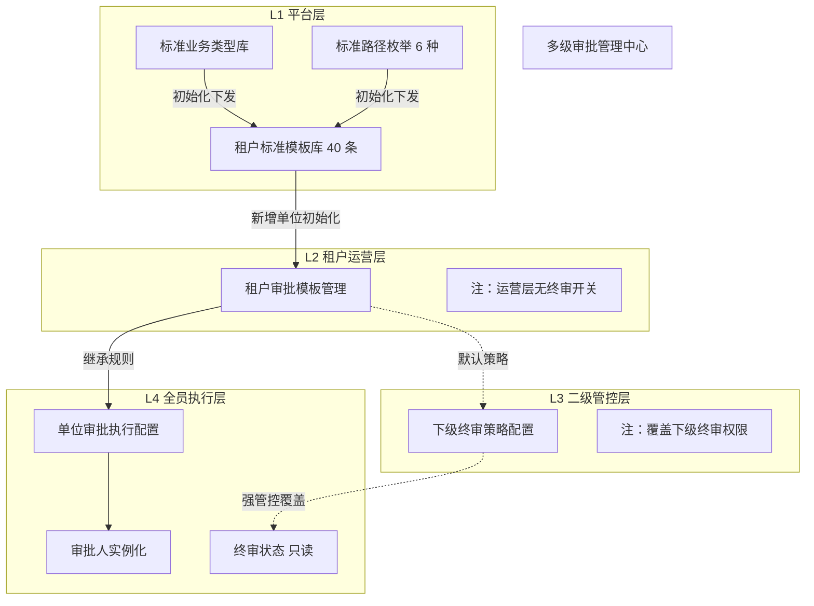

# 多级组织审批流程配置产品方案 V4.0

---

## 一、 功能概述

为多级组织（五级、四级、三级、二级、集团等）提供统一的审批模板配置能力。本方案采用**“四层解耦、层层递进”**的设计理念，将审批流的定义、规则、权限管控与执行人员分离，确保系统既具备全局规范性，又满足多级垂直管理的需求。

### 设计原则
1.  **平台造模具**：超级管理员定义标准业务流与固定审批路径。
2.  **运营定规则**：运营管理员配置节点规则（路径选择、节点候选人），但**不触碰终审权限**。
3.  **二级管权限**：二级单位拥有特权，针对特定上报本级的审批流，逐级决定其下级是否允许终审（覆盖策略）。
4.  **全员管执行**：各级单位基于下发的模板，仅负责配置具体的审批责任人。

---

## 二、 功能结构图

基于业务分层逻辑，系统的功能菜单及页面逻辑划分如下：




---

## 三、 详细需求说明

### 3.1 L1 平台层：系统初始化配置
**角色**：超级管理员
**功能路径**：`系统管理 -> 审批标准库`
**核心职责**：造模具。

#### A. 业务类型库维护
*   **预置数据**：系统内置标准审批业务类型（如：采购计划变更、合同审批、预算调整等，共 40 条）。
*   **初始化机制**：
    *   **新增租户时**：系统自动将这 40 条业务类型记录作为“初始模板”复制到该租户的审批模板库中。
    *   **新增下级单位时**：自动将父级单位现有的审批模板继承一份给新单位（含节点规则）。

#### B. 路径枚举字典
*   **固定路径**：系统硬编码定义 6 种标准审批路径模式，运营端不可新增或修改。
    *   *具体枚举值见文末附录*。

---

### 3.2 L2 租户运营层：审批模板规则
**角色**：租户运营管理员
**功能路径**：`运营管理 -> 审批模板配置`
**核心职责**：定规则（路径 + 节点），**不涉及终审权**。

#### A. 审批模板列表
*   展示当前租户下的标准业务模板（如 40 条）。
*   **状态**：已配置 / 未配置路径。

#### B. 模板详情页（规则配置）
1.  **基础信息（只读）**：业务名称。
2.  **路径选择（核心交互）**：
    *   提供下拉框，**仅限**从 6 种模式中选择（例如：选择“本级 - 逐级 - 二级”）。
    *   切换路径模式后，下方的节点列表结构自动刷新。
3.  **节点规则列表（可编辑）**：
    *   **节点名称**：可修改（如修改为“部门负责人审核”）。
    *   **候选人规则**：配置“指定角色/岗位/用户”。若选角色，需指定具体角色 ID。
    *   **关键限制**：此页面**严禁包含**“是否允许下级终审”的开关。

---

### 3.3 L3 二级管控层：下级终审策略
**角色**：二级组织管理员（拥有管控视角的特许权）
**功能路径**：`企业管理 -> 下级审批终审策略`
**核心职责**：按单位维度，逐条管控下属组织的最终审批权限。

#### A. 页面布局（左右分栏联动）
针对二级单位下属分支较多的场景，采用 **“下属单位树 + 策略列表”** 布局：
*   **左侧：下属单位树**
    *   展示当前二级单位管辖的所有下级组织（三级、四级、五级等）。
    *   支持按组织名称搜索。点击树节点，右侧面板即时切换至该单位的数据视图。
*   **右侧：终审策略配置表**
    *   **顶部提示**：`当前管控单位：[ 选中的下级单位名称 ]`
    *   **列表结构**：
        | 审批业务 | 运营默认策略 | **是否允许该单位终审** (覆盖开关) | 状态说明 |
        | :--- | :--- | :--- | :--- |
        | 采购计划变更 | 允许终审 | `[ 允许 ]` / `[ 禁止 ]` | 若禁止，该下级单位配置页对应选项将锁定 |
        | 预算调整审批 | 允许终审 | `[ 允许 ]` / `[ 禁止 ]` | |

#### B. 交互与管控逻辑
*   **配置粒度**：二级单位需为**每一个**下属单位单独配置其终审权限。不同下级单位可拥有不同的终审策略（如允许A公司终审，但禁止B公司终审）。
*   **状态继承**：新增下级单位时，默认继承二级单位已设定的策略基线（或默认“允许”），二级管理员可随时通过左侧树切换单位进行按需调整。
*   **下级视图联动**：当前被管控的下级单位在配置审批流时，若某业务被上级设为“禁止终审”，其界面将显示 🔒“终审权限已由上级[XX二级单位]强制管控”，且控件置灰只读。

---

### 3.4 L4 全员执行层：单位审批执行
**角色**：所有组织（集团、二级、三级等）的配置员
**功能路径**：`企业管理 -> 审批流执行配置`
**核心职责**：填人。

#### A. 审批人实例化（配置规则）
单位管理员点击“立即配置”进入详情页，针对本单位需负责的节点进行人员指派：

1.  **规则区（只读）**：展示审批路径（如 本级->二级）及节点规则（需部门经理角色）。
2.  **终审状态区（只读）**：
    *   **正常**：显示“允许本单位终审”。
    *   **受控**：显示🔒“禁止终审 (由上级 XX 单位管控)"。
3.  **人员区（必填）：节点即强制关卡与审批人池**。
    *   **权限边界**：各单位仅能配置**流转到本单位时**由谁来审。严禁跨级配置上级（如二级公司）或其他单位的审批人。
    *   **审批人池配置**：为各节点指定具体的审批人池（支持配置多人）。若规则基于角色，系统自动过滤出当前组织下具备该角色的用户供选择，加入该节点池。
    *   **实际流转逻辑**：节点内配置的多人不作为“或签”竞争，而是作为**候选池**。在实际发起审批时，当前节点审批完成后，当前审批人需**从该池中手动指定一名**人员作为下一节点的审批责任人。

---

## 四、 核心逻辑与校验

### 4.1 “覆盖逻辑”优先级
> **最终是否可终审 =**
> 1.  优先检查：**是否存在直属二级单位的强制策略？**
>     *   若有且为“禁止” -> **禁止**（界面锁定）。
> 2.  若无覆盖 -> **遵循默认配置**。

### 4.2 单位新增初始化
*   **场景**：在组织架构中新增一个下级单位（如三级单位 A）。
*   **动作**：系统自动继承其直接上级（所属二级公司）的审批模板副本。
    *   继承节点规则（路径、角色要求等）。
    *   **同步终审管控状态**：若所属二级公司已对该业务配置了“禁止下级终审”，则新单位初始化时，该状态直接锁定为“禁止”。

### 4.3 节点必填校验
*   保存配置时，所有节点必须有对应的审批人（具体用户或能解析出用户的角色），否则禁止提交。

---

## 五、 数据模型设计建议

为支撑“覆盖策略”独立于“模板规则”，建议新增一张覆盖策略表，避免污染模板主表。

### 5.1 核心表结构

| 表名 | 关键字段 | 业务含义 |
| :--- | :--- | :--- |
| **`sys_approval_def`** (模板) | `path_mode` (Int)<br>`step_config` (JSON) | 存储各级模板副本及节点规则。`path_mode` 对应 6 种枚举。 |
| **`sys_approval_override`** (新增) | `tier2_org_id` (Varchar)<br>`business_type` (Varchar)<br>`allow_final_approve` (Boolean) | **二级单位管控表**。存储特定二级单位对特定审批流的强制终审策略。 |

---

## 六、 附录：6 种固定路径枚举定义

|  枚举值  | 路径名称                | 流转逻辑示意                    |
| :---: | :------------------ | :------------------------ |
| **1** | 本级                  | 发起 -> 当前组织 (结束)           |
| **2** | 本级 - 逐级 - 二级        | 发起 -> 当前 -> ... -> 所属二级组织 |
| **3** | 本级 - 逐级 - 二级 - 采购中心 | 发起 -> ... -> 所属二级 -> 采购中心 |
| **4** | 本级 - 二级             | 发起 -> (跳过中间级) -> 所属二级组织   |
| **5** | 本级 - 采购中心           | 发起 -> (跳过中间级) -> 采购中心     |
| **6** | 采购中心                | 发起 -> (跳过本单位) -> 采购中心     |

---

## 七、 审批运行时逻辑与实例设计

本部分描述审批流在**发起 (Execute)** 及 **运行 (Runtime)** 阶段的实例化机制。针对“多级组织 + 组织内多节点”的复杂场景，系统采用 **“两层级联 + 链式长表”** 的架构。

### 7.1 核心概念：双层拼接
最终的审批流实例由两层逻辑拼接而成：
1.  **宏观路径（组织链）**：由运营配置的路径模式决定组织流转顺序（例如：三级公司 -> 二级公司）。
2.  **微观路径（节点链）**：每个组织内部配置的节点决定内部流转环节（例如：三级公司内设 Node A）。

**实例化结果**：系统将这两层逻辑拆解，拼接成一条 **扁平化的长链 (Long Chain)**，每个环节对应一条唯一的审批流水记录。

### 7.2 数据结构设计：审批实例流水表
为支撑“流式记录”和“逐级指定”，核心表 `sys_approval_instance_node` (审批流水表) 设计如下：

| 字段名 | 类型 | 必填 | 说明 |
| :--- | :--- | :--- | :--- |
| `instance_no` | Varchar | ✅ | 全局审批实例编号 |
| `global_step_no` | Int | ✅ | **全局流水号** (1, 2, 3...) 决定流转顺序 |
| `org_id` | Varchar | ✅ | **所属组织 ID** (明确当前环节属于哪个单位) |
| `step_name` | Varchar | ✅ | **组织内节点名称** (如：三级 - 部门经理审批) |
| `candidate_pool` | JSON | ✅ | **备选池** (配置时的多人名单，记录当时快照) |
| `assignee_uid` | Varchar | 💡 | **被指定审批人** (发起时或上一环节指定，初始可为空) |
| `node_status` | Varchar | ✅ | 状态：`WAIT_ASSIGN` (待指定) / `PENDING` (待审) / `APPROVED` / `REJECTED` |
| `audit_comment` | Text | 💡 | 审批意见及动作 |
| `complete_time` | Datetime | 💡 | 处理完成时间 |

### 7.3 运行机制与流转逻辑

假设场景：路径为“三级 -> 二级”。三级内部节点：Node A；二级内部节点：Node B。

#### 1. 发起时实例化 (初始化)
系统生成如下流水线 (Chain)：

| Step | 所属组织 | 节点名称 | 审批人 (assignee_uid) | 状态 |
| :--- | :--- | :--- | :--- | :--- |
| **1** | 三级公司 | Node A | **空** (待发起人指定) | `WAIT_ASSIGN` |
| **2** | 二级公司 | Node B | **空** (待 Step 1 选人) | `LOCKED` |

#### 2. 流转全过程
1.  **发起阶段**：发起人从 Step 1 的候选池中指定人员 (如：张三)。
    *   *动作*：Step 1 状态变为 `PENDING`。
2.  **Step 1 审批**：张三收到任务，审批通过。系统提示：“请为二级公司节点 B 指定审批人”。张三从池中选定 (如：王五)。
    *   *动作*：Step 1 更新为 `APPROVED`，记录张三审批意见；Step 2 的 `assignee_uid` 更新为王五，状态变为 `PENDING`。
3.  **Step 2 审批**：王五收到任务，审批完成。流程结束。

### 7.4 前端流式展示逻辑
前端基于 `global_step_no` 渲染时间轴进度条，数据来源于长表：

| 节点类型 | 视觉呈现 | 显示内容 |
| :--- | :--- | :--- |
| **已通过** | ✅ 实心 | 显示：单位、审批人 (张三)、完成时间、审批意见。 |
| **进行中** | 🔄 呼吸灯 | 显示：单位、当前处理人 (李四)、到达时间。 |
| **待指定** | ⏳ 虚线 | 显示：所属单位、节点名称，人员位置显示“待上一环节指定”。 |

这种 **链式长表** 设计确保了无论组织层级多深，系统只需按流水号遍历一次即可渲染出完整的审批进度，完美支持动态选人机制。

### 7.5 状态展示差异与截断逻辑

根据审批实例的运行状态，前端记录组件应遵循以下展示策略：

1.  **审批进行中 (Running)**：
    *   **展示全量节点**：初始化时，必须显示完整的审批流全貌（基于 `path_mode` 生成的所有节点）。
    *   **目的**：提供清晰的进度预期，让处理人知晓后续流转路径（如：本级 -> 二级 -> 中心）。
    *   **视觉**：已审批通过的节点高亮，未到达的节点显示为灰色“待到达”或“待指定”。

2.  **审批不通过/终止 (Rejected/Terminated)**：
    *   **展示截断**：记录列表仅需显示至**最终“不通过”的那个节点**为止。
    *   **目的**：明确流程已终结。由于业务规则为“不通过即从头审批”，后续未发生的节点不应再展示，以免产生误导。
    *   **视觉**：
        *   **当前节点（不通过）**：显示为 **红色** 高亮，必须醒目展示**驳回意见/终止原因**。
        *   **后续节点**：不渲染或在视觉上移除。

### 7.6 审批操作模式
*注：鉴于审批流记录内容较多且审批决策主要基于当前单据，审批建议采用 **弹窗 (Modal) 或 侧边抽屉 (Drawer)** 形式进行处理，避免与记录页签混淆，确保“看单据”与“做操作”的空间独立性。*

### 7.7 指定下一审批人交互方案 (核心)

在招采多级审批场景中，若审批人选择 **“同意通过”** 且后续仍有节点（无论属于当前单位还是其他单位），系统必须强制其指定下一环节的审批人。

#### A. 交互触发时机
审批人在处理当前节点时，点击 `[ 同意 ]` 按钮后，系统不会立即提交任务，而是触发 **“指定下一审批人”弹窗**。只有当审批人完成选人并确认后，审批动作才算彻底完成。

#### B. 弹窗布局设计
建议采用模态弹窗 (Modal)，布局需极简化，聚焦于“选择”操作：

```text
┌─ 🎯 指定下一节点审批人 ─────────────────────────────────┐
│                                                          │
│ 1. 目标节点信息 (只读展示)                                │
│ ├─ 所属单位：[ XX 二级公司 ]                             │
│ └─ 节点名称：[ 总经理审批 ]                              │
│                                                          │
│ ────── 分割线 ─────────────                             │
│                                                          │
│ 2. 选择审批人 (必填交互)                                 │
│                                                          │
│    🔘 请指定下一环节审批人：                              │
│    [ 请选择 ▼ ] (下拉选择器)                            │
│    ├─ 王五 (二级公司总经理)                              │
│    ├─ 赵六 (二级公司副总经理)                            │
│    └─ ...                                                │
│                                                          │
│ ───────────────────────────────────────────────────────  │
│ [ 确认提交 ] (置灰直到已选择)       [ 取消 ]             │
└──────────────────────────────────────────────────┘
```

#### C. 核心设计策略
1.  **极简展示**：无需额外展示大段“候选人池名单”文本。候选人名应直接内置于下拉选择器的选项中，保持界面整洁。
2.  **防呆阻断**：
    *   若用户未选择具体人员，`[确认提交]` 按钮保持禁用（Disable）状态，并提示“必须指定下一审批人”。
    *   此举防止用户因疏忽导致流程“悬停”在空状态节点。
3.  **自动默认处理**：若候选人池中仅有一人，建议系统自动默认选中该用户，用户仅需点击确认即可提交流程，降低操作成本。


TEST 